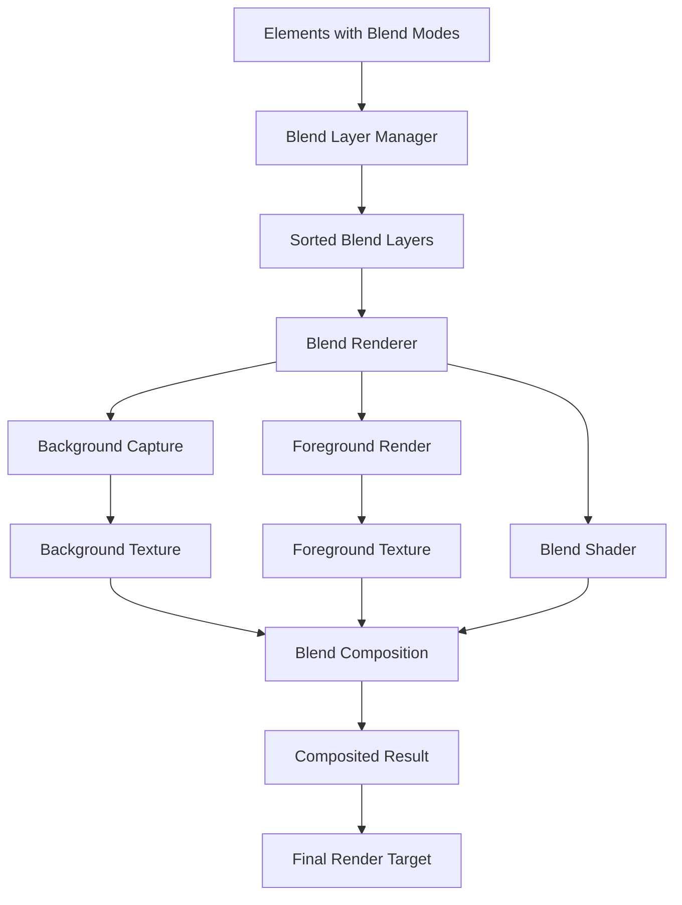

# Design Document

## Overview

The Blend Mode feature will provide comprehensive CSS `mix-blend-mode` support for ASTYLARUI by implementing shader-based compositing effects between overlapping elements in 3D space. The design creates a sophisticated blending system using custom fragment shaders and render target management, enabling multiply, screen, overlay, difference, and color component blend modes with configurable blend amounts while maintaining proper integration with z-index layering and existing rendering systems.

## Architecture

### Core Components

#### BlendModeService
The main service responsible for blend mode management and coordination.

```typescript
interface BlendModeService {
  applyBlendMode(element: DomElement, blendMode: BlendMode, amount?: number): void;
  updateBlendMode(element: DomElement, newBlendMode: BlendMode, amount?: number): void;
  removeBlendMode(element: DomElement): void;
  calculateBlendLayers(elements: DomElement[]): BlendLayer[];
  optimizeBlendChain(layers: BlendLayer[]): BlendLayer[];
}
```

#### BlendRenderer
Handles the creation and management of blend shaders and compositing operations.

```typescript
interface BlendRenderer {
  createBlendShader(blendMode: BlendMode): BABYLON.Effect;
  renderBlendedElement(element: DomElement, backgroundTexture: BABYLON.Texture): BABYLON.RenderTargetTexture;
  compositeBlendLayers(layers: BlendLayer[]): BABYLON.RenderTargetTexture;
  updateBlendParameters(shader: BABYLON.Effect, amount: number): void;
}
```

#### BlendShaderManager
Manages custom shaders for different blend mode algorithms.

```typescript
interface BlendShaderManager {
  createMultiplyShader(): BABYLON.Effect;
  createScreenShader(): BABYLON.Effect;
  createOverlayShader(): BABYLON.Effect;
  createColorDodgeShader(): BABYLON.Effect;
  createDifferenceShader(): BABYLON.Effect;
  createHueBlendShader(): BABYLON.Effect;
  createLuminosityBlendShader(): BABYLON.Effect;
}
```

#### BlendLayerManager
Manages the layering and compositing order for blended elements.

```typescript
interface BlendLayerManager {
  createBlendLayer(element: DomElement): BlendLayer;
  sortBlendLayers(layers: BlendLayer[]): BlendLayer[];
  calculateLayerDependencies(layers: BlendLayer[]): BlendDependency[];
  optimizeLayerComposition(layers: BlendLayer[]): BlendComposition;
}
```

### Blend System Architecture



## Components and Interfaces

### BlendMode
Enumeration of supported blend modes:

```typescript
enum BlendMode {
  Normal = 'normal',
  Multiply = 'multiply',
  Screen = 'screen',
  Overlay = 'overlay',
  Darken = 'darken',
  Lighten = 'lighten',
  ColorDodge = 'color-dodge',
  ColorBurn = 'color-burn',
  HardLight = 'hard-light',
  SoftLight = 'soft-light',
  Difference = 'difference',
  Exclusion = 'exclusion',
  Hue = 'hue',
  Saturation = 'saturation',
  Color = 'color',
  Luminosity = 'luminosity'
}
```

### BlendLayer
Represents a layer in the blend composition:

```typescript
interface BlendLayer {
  element: DomElement;
  blendMode: BlendMode;
  blendAmount: number;
  zIndex: number;
  renderTarget: BABYLON.RenderTargetTexture;
  dependencies: BlendLayer[];
  shader: BABYLON.Effect;
}
```

### BlendComposition
Configuration for blend layer composition:

```typescript
interface BlendComposition {
  layers: BlendLayer[];
  compositionOrder: number[];
  renderTargets: BABYLON.RenderTargetTexture[];
  finalComposition: BABYLON.RenderTargetTexture;
}
```

### BlendParameters
Shader parameters for blend calculations:

```typescript
interface BlendParameters {
  blendAmount: number;
  foregroundTexture: BABYLON.Texture;
  backgroundTexture: BABYLON.Texture;
  blendMode: BlendMode;
  elementOpacity: number;
}
```

## Data Models

### BlendState
State information for blended elements:

```typescript
interface BlendState {
  element: DomElement;
  blendMode: BlendMode;
  blendAmount: number;
  active: boolean;
  renderTarget?: BABYLON.RenderTargetTexture;
  shader?: BABYLON.Effect;
  lastUpdate: number;
}
```

### BlendDependency
Dependency relationships between blend layers:

```typescript
interface BlendDependency {
  layer: BlendLayer;
  dependsOn: BlendLayer[];
  affects: BlendLayer[];
  compositionOrder: number;
}
```

## Implementation Strategy

### Blend Shader Implementation

```typescript
class BlendShaderManager {
  createMultiplyShader(): BABYLON.Effect {
    const fragmentShader = `
      precision highp float;
      varying vec2 vUV;
      uniform sampler2D foregroundTexture;
      uniform sampler2D backgroundTexture;
      uniform float blendAmount;
      
      void main() {
        vec4 foreground = texture2D(foregroundTexture, vUV);
        vec4 background = texture2D(backgroundTexture, vUV);
        
        // Multiply blend mode
        vec3 blended = foreground.rgb * background.rgb;
        
        // Mix with normal blending based on blend amount
        vec3 result = mix(foreground.rgb, blended, blendAmount);
        
        gl_FragColor = vec4(result, foreground.a);
      }
    `;
    
    return this.createShaderEffect("multiplyBlend", fragmentShader);
  }
  
  createScreenShader(): BABYLON.Effect {
    const fragmentShader = `
      precision highp float;
      varying vec2 vUV;
      uniform sampler2D foregroundTexture;
      uniform sampler2D backgroundTexture;
      uniform float blendAmount;
      
      void main() {
        vec4 foreground = texture2D(foregroundTexture, vUV);
        vec4 background = texture2D(backgroundTexture, vUV);
        
        // Screen blend mode: 1 - (1 - fg) * (1 - bg)
        vec3 blended = 1.0 - (1.0 - foreground.rgb) * (1.0 - background.rgb);
        
        vec3 result = mix(foreground.rgb, blended, blendAmount);
        gl_FragColor = vec4(result, foreground.a);
      }
    `;
    
    return this.createShaderEffect("screenBlend", fragmentShader);
  }
  
  createOverlayShader(): BABYLON.Effect {
    const fragmentShader = `
      precision highp float;
      varying vec2 vUV;
      uniform sampler2D foregroundTexture;
      uniform sampler2D backgroundTexture;
      uniform float blendAmount;
      
      vec3 overlay(vec3 base, vec3 blend) {
        return mix(
          2.0 * base * blend,
          1.0 - 2.0 * (1.0 - base) * (1.0 - blend),
          step(0.5, base)
        );
      }
      
      void main() {
        vec4 foreground = texture2D(foregroundTexture, vUV);
        vec4 background = texture2D(backgroundTexture, vUV);
        
        vec3 blended = overlay(background.rgb, foreground.rgb);
        vec3 result = mix(foreground.rgb, blended, blendAmount);
        
        gl_FragColor = vec4(result, foreground.a);
      }
    `;
    
    return this.createShaderEffect("overlayBlend", fragmentShader);
  }
}
```

### Color Component Blend Shaders

```typescript
class ColorComponentBlendShaders {
  createHueBlendShader(): BABYLON.Effect {
    const fragmentShader = `
      precision highp float;
      varying vec2 vUV;
      uniform sampler2D foregroundTexture;
      uniform sampler2D backgroundTexture;
      uniform float blendAmount;
      
      vec3 rgb2hsl(vec3 color) {
        float maxVal = max(max(color.r, color.g), color.b);
        float minVal = min(min(color.r, color.g), color.b);
        float delta = maxVal - minVal;
        
        float h = 0.0;
        float s = 0.0;
        float l = (maxVal + minVal) / 2.0;
        
        if (delta > 0.0) {
          s = l > 0.5 ? delta / (2.0 - maxVal - minVal) : delta / (maxVal + minVal);
          
          if (maxVal == color.r) {
            h = (color.g - color.b) / delta + (color.g < color.b ? 6.0 : 0.0);
          } else if (maxVal == color.g) {
            h = (color.b - color.r) / delta + 2.0;
          } else {
            h = (color.r - color.g) / delta + 4.0;
          }
          h /= 6.0;
        }
        
        return vec3(h, s, l);
      }
      
      vec3 hsl2rgb(vec3 hsl) {
        float h = hsl.x;
        float s = hsl.y;
        float l = hsl.z;
        
        if (s == 0.0) {
          return vec3(l);
        }
        
        float q = l < 0.5 ? l * (1.0 + s) : l + s - l * s;
        float p = 2.0 * l - q;
        
        float r = hue2rgb(p, q, h + 1.0/3.0);
        float g = hue2rgb(p, q, h);
        float b = hue2rgb(p, q, h - 1.0/3.0);
        
        return vec3(r, g, b);
      }
      
      float hue2rgb(float p, float q, float t) {
        if (t < 0.0) t += 1.0;
        if (t > 1.0) t -= 1.0;
        if (t < 1.0/6.0) return p + (q - p) * 6.0 * t;
        if (t < 1.0/2.0) return q;
        if (t < 2.0/3.0) return p + (q - p) * (2.0/3.0 - t) * 6.0;
        return p;
      }
      
      void main() {
        vec4 foreground = texture2D(foregroundTexture, vUV);
        vec4 background = texture2D(backgroundTexture, vUV);
        
        vec3 fgHSL = rgb2hsl(foreground.rgb);
        vec3 bgHSL = rgb2hsl(background.rgb);
        
        // Blend hue only, keep background saturation and lightness
        vec3 blendedHSL = vec3(fgHSL.x, bgHSL.y, bgHSL.z);
        vec3 blended = hsl2rgb(blendedHSL);
        
        vec3 result = mix(foreground.rgb, blended, blendAmount);
        gl_FragColor = vec4(result, foreground.a);
      }
    `;
    
    return this.createShaderEffect("hueBlend", fragmentShader);
  }
}
```

### Blend Layer Management

```typescript
class BlendLayerManager {
  createBlendLayer(element: DomElement): BlendLayer {
    const renderTarget = new BABYLON.RenderTargetTexture(
      `blendLayer_${element.id}`,
      { width: element.dimensions.width, height: element.dimensions.height },
      this.scene
    );
    
    const shader = this.blendShaderManager.createBlendShader(element.blendMode);
    
    return {
      element,
      blendMode: element.blendMode,
      blendAmount: element.blendAmount || 1.0,
      zIndex: element.style.zIndex || 0,
      renderTarget,
      dependencies: [],
      shader
    };
  }
  
  sortBlendLayers(layers: BlendLayer[]): BlendLayer[] {
    // Sort by z-index to ensure proper compositing order
    return layers.sort((a, b) => a.zIndex - b.zIndex);
  }
  
  calculateLayerDependencies(layers: BlendLayer[]): BlendDependency[] {
    const dependencies: BlendDependency[] = [];
    
    for (let i = 0; i < layers.length; i++) {
      const layer = layers[i];
      const dependsOn: BlendLayer[] = [];
      
      // Find layers that this layer depends on (lower z-index)
      for (let j = 0; j < i; j++) {
        if (this.layersOverlap(layers[j], layer)) {
          dependsOn.push(layers[j]);
        }
      }
      
      dependencies.push({
        layer,
        dependsOn,
        affects: [], // Will be calculated in second pass
        compositionOrder: i
      });
    }
    
    return dependencies;
  }
}
```

### Blend Composition Implementation

```typescript
class BlendRenderer {
  renderBlendedElement(element: DomElement, backgroundTexture: BABYLON.Texture): BABYLON.RenderTargetTexture {
    const renderTarget = new BABYLON.RenderTargetTexture(
      `blended_${element.id}`,
      { width: element.dimensions.width, height: element.dimensions.height },
      this.scene
    );
    
    // Create blend material
    const blendMaterial = new BABYLON.ShaderMaterial("blendMaterial", this.scene, {
      vertex: "blendVertex",
      fragment: "blendFragment"
    }, {
      attributes: ["position", "uv"],
      uniforms: ["worldViewProjection", "blendAmount"],
      samplers: ["foregroundTexture", "backgroundTexture"]
    });
    
    // Set textures and parameters
    blendMaterial.setTexture("foregroundTexture", element.texture);
    blendMaterial.setTexture("backgroundTexture", backgroundTexture);
    blendMaterial.setFloat("blendAmount", element.blendAmount || 1.0);
    
    // Render to target
    renderTarget.renderList = [element.mesh];
    element.mesh.material = blendMaterial;
    
    return renderTarget;
  }
  
  compositeBlendLayers(layers: BlendLayer[]): BABYLON.RenderTargetTexture {
    const finalTarget = new BABYLON.RenderTargetTexture(
      "finalComposition",
      { width: this.scene.getEngine().getRenderWidth(), height: this.scene.getEngine().getRenderHeight() },
      this.scene
    );
    
    // Composite layers from back to front
    let currentBackground: BABYLON.Texture | null = null;
    
    for (const layer of layers) {
      if (currentBackground) {
        const blendedResult = this.renderBlendedElement(layer.element, currentBackground);
        currentBackground = blendedResult;
      } else {
        // First layer becomes the background
        currentBackground = layer.renderTarget;
      }
    }
    
    // Copy final result to target
    if (currentBackground) {
      this.copyTextureToTarget(currentBackground, finalTarget);
    }
    
    return finalTarget;
  }
}
```

## Integration Points

### BabylonDomService Extension
Integration with existing DOM element creation:

```typescript
// In babylon-dom.service.ts
private handleBlendModeElement(element: DomElement): void {
  const blendMode = element.style.mixBlendMode;
  const blendAmount = element.style.blendAmount || 1.0;
  
  if (blendMode && blendMode !== BlendMode.Normal) {
    this.blendModeService.applyBlendMode(element, blendMode, blendAmount);
  }
}
```

### Z-Index Integration
Coordination with existing layering systems:

```typescript
// In layering management
private updateBlendLayering(): void {
  const blendedElements = this.getElementsWithBlendModes();
  const blendLayers = this.blendModeService.calculateBlendLayers(blendedElements);
  const optimizedLayers = this.blendModeService.optimizeBlendChain(blendLayers);
  
  this.renderBlendComposition(optimizedLayers);
}
```

## Performance Optimizations

### Blend Caching
- Cache blend results for static elements
- Implement dirty checking for blend parameter changes
- Share blend textures between similar blend operations

### Shader Optimization
- Combine multiple blend operations into single shader passes
- Use efficient color space conversions
- Implement adaptive quality based on element visibility

### Render Target Management
- Pool render targets for similar-sized elements
- Dispose unused render targets promptly
- Optimize render target resolution based on element importance

## Error Handling

### Blend Mode Validation
- Handle unsupported blend modes gracefully
- Provide fallbacks for shader compilation failures
- Validate blend amount values and clamp to valid ranges

### Performance Issues
- Monitor blend performance and provide fallbacks
- Implement automatic quality reduction for complex scenes
- Provide configuration options for performance tuning

### Rendering Conflicts
- Handle overlapping blend areas correctly
- Resolve conflicts between blend modes and other effects
- Manage blend mode interactions with transparency

```typescript
interface BlendModeErrorHandler {
  handleUnsupportedBlendMode(blendMode: BlendMode): BlendMode;
  handleShaderCompilationError(blendMode: BlendMode, error: Error): BABYLON.Effect | null;
  handlePerformanceIssue(layers: BlendLayer[]): BlendLayer[];
}
```

## Testing Strategy

### Visual Test Sites
Test sites will be created in `site-data.service.ts` to validate blend functionality:

1. **Basic Blend Modes**: Individual blend modes (multiply, screen, overlay, etc.)
2. **Color Component Blends**: Hue, saturation, color, and luminosity blending
3. **Blend Amount Control**: Variable blend intensity from 0% to 100%
4. **Layered Blending**: Multiple overlapping elements with different blend modes
5. **Performance Test**: Many elements with various blend mode combinations
6. **Integration Test**: Blend modes with transforms, animations, and interactions

### Expected Visual Outcomes
Each test site will include documentation of expected blend appearance and performance characteristics.

## Dependencies

### BabylonJS Features
- Custom shader creation and compilation
- Render target texture management
- Material system for blend composition
- Post-processing pipeline integration

### WebGL Features
- Fragment shader support for blend calculations
- Multiple render target support
- Efficient texture sampling and blending

### Existing ASTYLARUI Services
- BabylonDomService: DOM element integration
- BabylonMeshService: Mesh and material management
- Style parsing services: CSS blend mode property processing
- Z-index management: Layer ordering and composition

## Future Enhancements

### Advanced Blend Features
- Custom blend mode functions
- Backdrop blend modes for background effects
- Isolation groups for controlled blend scoping
- Blend mode animations and transitions

### Performance Features
- GPU-accelerated blend composition
- Multi-threaded blend processing
- Adaptive quality based on device capabilities
- Blend mode level-of-detail systems

### Developer Tools
- Blend mode preview and debugging
- Performance profiling for blend operations
- Visual blend mode editor interface
- Blend composition visualization tools