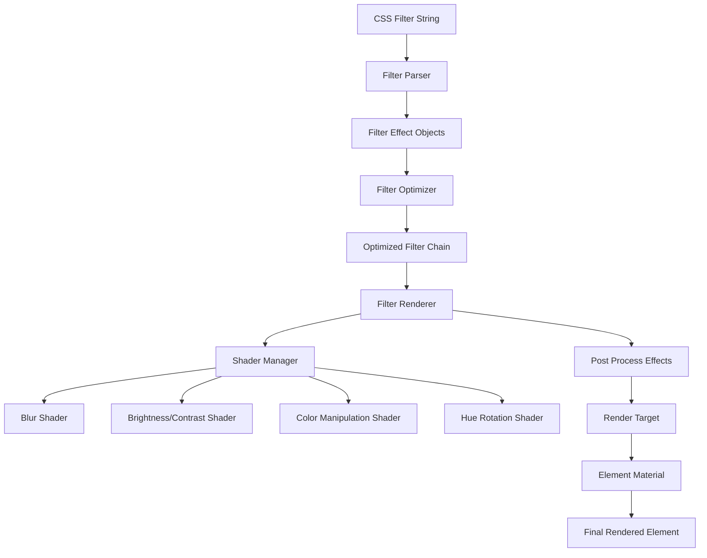

# Design Document

## Overview

The Filter Effects feature will provide comprehensive CSS filter support for BJSUI by implementing shader-based visual effects that can be applied to DOM elements in 3D space. The design creates a modular filter system using BabylonJS post-processing effects and custom shaders, enabling blur, brightness, contrast, color manipulation, and combination effects while maintaining real-time performance and proper integration with existing material and rendering systems.

## Architecture

### Core Components

#### FilterEffectService
The main service responsible for filter effect management and coordination.

```typescript
interface FilterEffectService {
  applyFilters(element: DomElement, filters: FilterEffect[]): void;
  updateFilters(element: DomElement, newFilters: FilterEffect[]): void;
  removeFilters(element: DomElement): void;
  parseFilterString(filterString: string): FilterEffect[];
  optimizeFilterChain(filters: FilterEffect[]): FilterEffect[];
}
```

#### FilterRenderer
Handles the creation and management of filter shaders and post-processing effects.

```typescript
interface FilterRenderer {
  createFilterEffect(filter: FilterEffect): BABYLON.PostProcess;
  updateFilterParameters(effect: BABYLON.PostProcess, filter: FilterEffect): void;
  combineFilterEffects(filters: FilterEffect[]): BABYLON.PostProcess[];
  disposeFilterEffect(effect: BABYLON.PostProcess): void;
}
```

#### FilterShaderManager
Manages custom shaders for filter effects.

```typescript
interface FilterShaderManager {
  createBlurShader(radius: number): BABYLON.Effect;
  createBrightnessContrastShader(brightness: number, contrast: number): BABYLON.Effect;
  createColorManipulationShader(params: ColorManipulationParams): BABYLON.Effect;
  createHueRotationShader(angle: number): BABYLON.Effect;
  createCombinedFilterShader(filters: FilterEffect[]): BABYLON.Effect;
}
```

#### FilterOptimizer
Optimizes filter performance and manages filter caching.

```typescript
interface FilterOptimizer {
  optimizeFilterChain(filters: FilterEffect[]): FilterEffect[];
  shouldCacheFilter(element: DomElement, filters: FilterEffect[]): boolean;
  getCachedFilterResult(cacheKey: string): BABYLON.RenderTargetTexture | null;
  setCachedFilterResult(cacheKey: string, result: BABYLON.RenderTargetTexture): void;
}
```

### Filter System Architecture



## Components and Interfaces

### FilterEffect
Base interface for all filter effects:

```typescript
interface FilterEffect {
  type: FilterType;
  value: number | string;
  unit?: string;
  enabled: boolean;
}

enum FilterType {
  Blur = 'blur',
  Brightness = 'brightness',
  Contrast = 'contrast',
  Grayscale = 'grayscale',
  HueRotate = 'hue-rotate',
  Invert = 'invert',
  Saturate = 'saturate',
  Sepia = 'sepia'
}
```

### Specialized Filter Interfaces

```typescript
interface BlurFilter extends FilterEffect {
  type: FilterType.Blur;
  radius: number; // in pixels
}

interface BrightnessFilter extends FilterEffect {
  type: FilterType.Brightness;
  multiplier: number; // 0-∞, 1 = normal
}

interface ContrastFilter extends FilterEffect {
  type: FilterType.Contrast;
  multiplier: number; // 0-∞, 1 = normal
}

interface ColorManipulationFilter extends FilterEffect {
  type: FilterType.Grayscale | FilterType.Sepia | FilterType.Saturate;
  amount: number; // 0-1 for grayscale/sepia, 0-∞ for saturate
}

interface HueRotateFilter extends FilterEffect {
  type: FilterType.HueRotate;
  angle: number; // in degrees
}

interface InvertFilter extends FilterEffect {
  type: FilterType.Invert;
  amount: number; // 0-1
}
```

### FilterChain
Collection of filters applied to an element:

```typescript
interface FilterChain {
  element: DomElement;
  filters: FilterEffect[];
  postProcesses: BABYLON.PostProcess[];
  renderTarget?: BABYLON.RenderTargetTexture;
  cached: boolean;
  lastUpdate: number;
}
```

## Data Models

### FilterParameters
Shader parameters for filter effects:

```typescript
interface FilterParameters {
  blur?: {
    radius: number;
    quality: number;
  };
  brightnessContrast?: {
    brightness: number;
    contrast: number;
  };
  colorManipulation?: {
    grayscale: number;
    sepia: number;
    saturate: number;
    invert: number;
  };
  hueRotation?: {
    angle: number;
  };
}
```

### FilterCache
Caching system for filter results:

```typescript
interface FilterCache {
  key: string; // Hash of element + filter chain
  renderTarget: BABYLON.RenderTargetTexture;
  lastUsed: number;
  referenceCount: number;
}
```

## Implementation Strategy

### Filter Parsing Implementation

```typescript
class FilterParser {
  parseFilterString(filterString: string): FilterEffect[] {
    const filters: FilterEffect[] = [];
    const filterRegex = /(\w+)\(([^)]+)\)/g;
    let match;
    
    while ((match = filterRegex.exec(filterString)) !== null) {
      const [, filterName, filterValue] = match;
      const filter = this.createFilterEffect(filterName, filterValue);
      if (filter) {
        filters.push(filter);
      }
    }
    
    return filters;
  }
  
  private createFilterEffect(name: string, value: string): FilterEffect | null {
    switch (name.toLowerCase()) {
      case 'blur':
        return {
          type: FilterType.Blur,
          value: this.parsePixelValue(value),
          enabled: true
        } as BlurFilter;
      
      case 'brightness':
        return {
          type: FilterType.Brightness,
          value: parseFloat(value),
          enabled: true
        } as BrightnessFilter;
      
      case 'contrast':
        return {
          type: FilterType.Contrast,
          value: parseFloat(value),
          enabled: true
        } as ContrastFilter;
      
      case 'grayscale':
        return {
          type: FilterType.Grayscale,
          value: this.parsePercentageOrDecimal(value),
          enabled: true
        } as ColorManipulationFilter;
      
      case 'hue-rotate':
        return {
          type: FilterType.HueRotate,
          value: this.parseDegreeValue(value),
          enabled: true
        } as HueRotateFilter;
      
      default:
        return null;
    }
  }
}
```

### Blur Filter Shader Implementation

```typescript
class BlurFilterShader {
  createBlurShader(radius: number): BABYLON.Effect {
    const vertexShader = `
      attribute vec2 position;
      varying vec2 vUV;
      
      void main() {
        vUV = (position + 1.0) / 2.0;
        gl_Position = vec4(position, 0.0, 1.0);
      }
    `;
    
    const fragmentShader = `
      precision highp float;
      varying vec2 vUV;
      uniform sampler2D textureSampler;
      uniform float blurRadius;
      uniform vec2 screenSize;
      
      void main() {
        vec2 texelSize = 1.0 / screenSize;
        vec4 color = vec4(0.0);
        float totalWeight = 0.0;
        
        // Gaussian blur implementation
        for (float x = -blurRadius; x <= blurRadius; x += 1.0) {
          for (float y = -blurRadius; y <= blurRadius; y += 1.0) {
            vec2 offset = vec2(x, y) * texelSize;
            float weight = exp(-(x*x + y*y) / (2.0 * blurRadius * blurRadius));
            color += texture2D(textureSampler, vUV + offset) * weight;
            totalWeight += weight;
          }
        }
        
        gl_FragColor = color / totalWeight;
      }
    `;
    
    return new BABYLON.Effect("blurFilter", ["position"], ["blurRadius", "screenSize"], ["textureSampler"], vertexShader, fragmentShader, this.engine);
  }
}
```

### Color Manipulation Shader Implementation

```typescript
class ColorManipulationShader {
  createColorManipulationShader(params: ColorManipulationParams): BABYLON.Effect {
    const fragmentShader = `
      precision highp float;
      varying vec2 vUV;
      uniform sampler2D textureSampler;
      uniform float grayscale;
      uniform float sepia;
      uniform float saturate;
      uniform float invert;
      uniform float brightness;
      uniform float contrast;
      
      vec3 rgb2hsv(vec3 c) {
        vec4 K = vec4(0.0, -1.0 / 3.0, 2.0 / 3.0, -1.0);
        vec4 p = mix(vec4(c.bg, K.wz), vec4(c.gb, K.xy), step(c.b, c.g));
        vec4 q = mix(vec4(p.xyw, c.r), vec4(c.r, p.yzx), step(p.x, c.r));
        float d = q.x - min(q.w, q.y);
        float e = 1.0e-10;
        return vec3(abs(q.z + (q.w - q.y) / (6.0 * d + e)), d / (q.x + e), q.x);
      }
      
      vec3 hsv2rgb(vec3 c) {
        vec4 K = vec4(1.0, 2.0 / 3.0, 1.0 / 3.0, 3.0);
        vec3 p = abs(fract(c.xxx + K.xyz) * 6.0 - K.www);
        return c.z * mix(K.xxx, clamp(p - K.xxx, 0.0, 1.0), c.y);
      }
      
      void main() {
        vec4 color = texture2D(textureSampler, vUV);
        
        // Apply brightness and contrast
        color.rgb = (color.rgb - 0.5) * contrast + 0.5;
        color.rgb *= brightness;
        
        // Apply grayscale
        if (grayscale > 0.0) {
          float gray = dot(color.rgb, vec3(0.299, 0.587, 0.114));
          color.rgb = mix(color.rgb, vec3(gray), grayscale);
        }
        
        // Apply sepia
        if (sepia > 0.0) {
          vec3 sepiaColor = vec3(
            dot(color.rgb, vec3(0.393, 0.769, 0.189)),
            dot(color.rgb, vec3(0.349, 0.686, 0.168)),
            dot(color.rgb, vec3(0.272, 0.534, 0.131))
          );
          color.rgb = mix(color.rgb, sepiaColor, sepia);
        }
        
        // Apply saturation
        if (saturate != 1.0) {
          vec3 hsv = rgb2hsv(color.rgb);
          hsv.y *= saturate;
          color.rgb = hsv2rgb(hsv);
        }
        
        // Apply invert
        if (invert > 0.0) {
          color.rgb = mix(color.rgb, 1.0 - color.rgb, invert);
        }
        
        gl_FragColor = color;
      }
    `;
    
    return this.createShaderEffect("colorManipulation", fragmentShader);
  }
}
```

### Filter Chain Optimization

```typescript
class FilterOptimizer {
  optimizeFilterChain(filters: FilterEffect[]): FilterEffect[] {
    // Combine similar filters
    const optimized = this.combineSimilarFilters(filters);
    
    // Remove redundant filters
    const filtered = this.removeRedundantFilters(optimized);
    
    // Reorder for optimal performance
    return this.reorderFilters(filtered);
  }
  
  private combineSimilarFilters(filters: FilterEffect[]): FilterEffect[] {
    const combined: FilterEffect[] = [];
    const brightnessFilters = filters.filter(f => f.type === FilterType.Brightness);
    const contrastFilters = filters.filter(f => f.type === FilterType.Contrast);
    
    // Combine multiple brightness filters
    if (brightnessFilters.length > 1) {
      const totalBrightness = brightnessFilters.reduce((acc, f) => acc * (f.value as number), 1);
      combined.push({
        type: FilterType.Brightness,
        value: totalBrightness,
        enabled: true
      });
    } else if (brightnessFilters.length === 1) {
      combined.push(brightnessFilters[0]);
    }
    
    // Add other filters that weren't combined
    const otherFilters = filters.filter(f => 
      f.type !== FilterType.Brightness && f.type !== FilterType.Contrast
    );
    combined.push(...otherFilters);
    
    return combined;
  }
}
```

### Filter Application Implementation

```typescript
class FilterRenderer {
  applyFiltersToElement(element: DomElement, filters: FilterEffect[]): void {
    // Create render target for filtered content
    const renderTarget = new BABYLON.RenderTargetTexture(
      "filterTarget",
      { width: element.dimensions.width, height: element.dimensions.height },
      this.scene
    );
    
    // Create post-process chain
    const postProcesses = this.createPostProcessChain(filters);
    
    // Apply post-processes to element
    element.mesh.material = this.createFilteredMaterial(renderTarget, postProcesses);
    
    // Store filter chain for updates
    element.filterChain = {
      element,
      filters,
      postProcesses,
      renderTarget,
      cached: false,
      lastUpdate: performance.now()
    };
  }
  
  private createPostProcessChain(filters: FilterEffect[]): BABYLON.PostProcess[] {
    const postProcesses: BABYLON.PostProcess[] = [];
    
    for (const filter of filters) {
      const postProcess = this.createPostProcessForFilter(filter);
      if (postProcess) {
        postProcesses.push(postProcess);
      }
    }
    
    return postProcesses;
  }
}
```

## Integration Points

### BabylonDomService Extension
Integration with existing DOM element creation:

```typescript
// In babylon-dom.service.ts
private handleFilteredElement(element: DomElement): void {
  const filterString = element.style.filter;
  
  if (filterString) {
    const filters = this.filterEffectService.parseFilterString(filterString);
    this.filterEffectService.applyFilters(element, filters);
  }
}
```

### Material System Integration
Coordination with existing material management:

```typescript
// In material management
private createFilteredMaterial(element: DomElement, renderTarget: BABYLON.RenderTargetTexture): BABYLON.Material {
  const material = new BABYLON.StandardMaterial("filteredMaterial", this.scene);
  material.diffuseTexture = renderTarget;
  material.hasAlpha = true;
  
  return material;
}
```

## Performance Optimizations

### Filter Caching
- Cache filter results for static elements
- Implement LRU cache eviction for filter textures
- Share filter results between identical filter chains

### Shader Optimization
- Combine multiple filters into single shader passes
- Use efficient blur algorithms (separable Gaussian)
- Implement adaptive quality based on element size

### Render Target Management
- Pool render targets for similar-sized elements
- Dispose unused render targets promptly
- Optimize render target resolution based on element visibility

## Error Handling

### Filter Parsing Errors
- Handle invalid filter syntax gracefully
- Provide fallbacks for unsupported filter types
- Log warnings for malformed filter values

### Shader Compilation Errors
- Provide fallback shaders for compilation failures
- Handle WebGL capability limitations
- Graceful degradation for unsupported features

### Performance Issues
- Monitor filter performance and provide fallbacks
- Implement automatic quality reduction
- Provide configuration options for performance tuning

```typescript
interface FilterErrorHandler {
  handleFilterParsingError(filterString: string, error: Error): FilterEffect[];
  handleShaderCompilationError(filter: FilterEffect, error: Error): BABYLON.PostProcess | null;
  handlePerformanceIssue(element: DomElement, filters: FilterEffect[]): void;
}
```

## Testing Strategy

### Visual Test Sites
Test sites will be created in `site-data.service.ts` to validate filter functionality:

1. **Basic Filters**: Individual filter effects (blur, brightness, contrast, etc.)
2. **Color Manipulation**: Grayscale, sepia, saturation, and inversion effects
3. **Filter Combinations**: Multiple filters applied to single elements
4. **Animated Filters**: Filter values changing over time
5. **Performance Test**: Many elements with various filter combinations
6. **Integration Test**: Filters with hover states and interactions

### Expected Visual Outcomes
Each test site will include documentation of expected filter appearance and performance characteristics.

## Dependencies

### BabylonJS Features
- Post-processing pipeline for filter effects
- Custom shader creation and compilation
- Render target texture management
- Material system for filtered content

### WebGL Features
- Fragment shader support for filter effects
- Texture sampling and manipulation
- Efficient GPU-based image processing

### Existing BJSUI Services
- BabylonDomService: DOM element integration
- BabylonMeshService: Mesh and material management
- Style parsing services: CSS filter property processing

## Future Enhancements

### Advanced Filter Effects
- Drop shadow filters (alternative to box-shadow)
- Custom filter functions and effects
- SVG filter integration
- Backdrop filters for background effects

### Performance Features
- WebGL 2.0 optimizations
- Compute shader support for complex filters
- Multi-threaded filter processing
- Adaptive quality based on device capabilities

### Developer Tools
- Filter effect preview and debugging
- Performance profiling for filter chains
- Visual filter editor interface