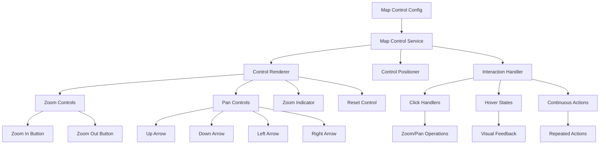

# Design Document

## Overview

The Map Controls feature will provide visual UI controls for zoom and pan operations within BJSUI containers, offering an alternative to keyboard and mouse shortcuts through clickable 3D interface elements. The design creates a modular control system with configurable positioning, styling, and functionality that integrates seamlessly with existing zoom and pan systems while maintaining consistent visual design and accessibility standards.

## Architecture

### Core Components

#### MapControlService
The main service responsible for map control management and coordination.

```typescript
interface MapControlService {
  enableMapControls(container: DomElement, config: MapControlConfig): MapControlSet;
  updateControlStates(controlSet: MapControlSet): void;
  handleControlInteraction(control: MapControl, interaction: ControlInteraction): void;
  positionControls(controlSet: MapControlSet, container: DomElement): void;
  disposeMapControls(controlSet: MapControlSet): void;
}
```

#### MapControlRenderer
Handles the creation and styling of individual control elements.

```typescript
interface MapControlRenderer {
  createZoomControls(config: ZoomControlConfig): ZoomControls;
  createPanControls(config: PanControlConfig): PanControls;
  createZoomIndicator(config: IndicatorConfig): ZoomIndicator;
  createResetControl(config: ResetControlConfig): ResetControl;
  applyControlStyling(control: MapControl, style: ControlStyle): void;
}
```

#### ControlPositioner
Manages the positioning and layout of control elements relative to containers.

```typescript
interface ControlPositioner {
  calculateControlPosition(control: MapControl, container: DomElement, position: ControlPosition): Vector3;
  updateControlLayout(controlSet: MapControlSet, containerBounds: Rectangle): void;
  handleContainerResize(controlSet: MapControlSet, newBounds: Rectangle): void;
  ensureControlVisibility(control: MapControl, containerBounds: Rectangle): void;
}
```

#### ControlInteractionHandler
Handles user interactions with map control elements.

```typescript
interface ControlInteractionHandler {
  handleControlClick(control: MapControl): void;
  handleControlHover(control: MapControl, isHovering: boolean): void;
  handleControlPress(control: MapControl, isPressed: boolean): void;
  handleContinuousAction(control: MapControl, action: ContinuousAction): void;
}
```

### Map Control Architecture



## Components and Interfaces

### MapControlConfig
Configuration for map control behavior and appearance:

```typescript
interface MapControlConfig {
  enabled: boolean;
  position: ControlPosition;
  controls: EnabledControls;
  styling: ControlStyling;
  behavior: ControlBehavior;
}

interface EnabledControls {
  zoom: boolean;
  pan: boolean;
  indicator: boolean;
  reset: boolean;
}

enum ControlPosition {
  TopLeft = 'top-left',
  TopRight = 'top-right',
  BottomLeft = 'bottom-left',
  BottomRight = 'bottom-right',
  Custom = 'custom'
}
```

### MapControlSet
Collection of control elements for a container:

```typescript
interface MapControlSet {
  container: DomElement;
  config: MapControlConfig;
  controls: Map<ControlType, MapControl>;
  controlGroup: BABYLON.TransformNode;
  positioner: ControlPositioner;
  interactionHandler: ControlInteractionHandler;
}

enum ControlType {
  ZoomIn = 'zoomIn',
  ZoomOut = 'zoomOut',
  PanUp = 'panUp',
  PanDown = 'panDown',
  PanLeft = 'panLeft',
  PanRight = 'panRight',
  ZoomIndicator = 'zoomIndicator',
  Reset = 'reset'
}
```

### MapControl
Base interface for individual control elements:

```typescript
interface MapControl {
  type: ControlType;
  mesh: BABYLON.Mesh;
  material: BABYLON.Material;
  enabled: boolean;
  visible: boolean;
  state: ControlState;
  action: ControlAction;
  continuousAction?: ContinuousAction;
}

enum ControlState {
  Normal = 'normal',
  Hover = 'hover',
  Pressed = 'pressed',
  Disabled = 'disabled',
  Focused = 'focused'
}
```

### ZoomControls
Specialized controls for zoom operations:

```typescript
interface ZoomControls {
  zoomIn: MapControl;
  zoomOut: MapControl;
  currentZoomLevel: number;
  zoomStep: number;
  minZoom: number;
  maxZoom: number;
}
```

### PanControls
Specialized controls for pan operations:

```typescript
interface PanControls {
  up: MapControl;
  down: MapControl;
  left: MapControl;
  right: MapControl;
  panStep: number;
  panBounds: PanBounds;
}
```

## Data Models

### ControlAction
Action configuration for control interactions:

```typescript
interface ControlAction {
  type: ActionType;
  value?: number;
  direction?: Vector2;
  callback?: () => void;
}

enum ActionType {
  ZoomIn = 'zoomIn',
  ZoomOut = 'zoomOut',
  Pan = 'pan',
  Reset = 'reset',
  SetZoom = 'setZoom'
}
```

### ControlStyling
Styling configuration for control appearance:

```typescript
interface ControlStyling {
  size: number;
  spacing: number;
  colors: ControlColors;
  fonts: ControlFonts;
  borders: ControlBorders;
  shadows: ControlShadows;
}

interface ControlColors {
  background: string;
  foreground: string;
  hover: string;
  pressed: string;
  disabled: string;
  border: string;
}
```

### ContinuousAction
Configuration for continuous/repeated actions:

```typescript
interface ContinuousAction {
  enabled: boolean;
  initialDelay: number;
  repeatInterval: number;
  action: ControlAction;
  timerId?: number;
}
```

## Implementation Strategy

### Control Creation Implementation

```typescript
class MapControlRenderer {
  createZoomControls(config: ZoomControlConfig): ZoomControls {
    // Create zoom in button
    const zoomInMesh = this.createControlButton('+', config.size);
    const zoomInControl: MapControl = {
      type: ControlType.ZoomIn,
      mesh: zoomInMesh,
      material: this.createControlMaterial(config.styling.colors),
      enabled: true,
      visible: true,
      state: ControlState.Normal,
      action: {
        type: ActionType.ZoomIn,
        value: config.zoomStep
      }
    };
    
    // Create zoom out button
    const zoomOutMesh = this.createControlButton('-', config.size);
    const zoomOutControl: MapControl = {
      type: ControlType.ZoomOut,
      mesh: zoomOutMesh,
      material: this.createControlMaterial(config.styling.colors),
      enabled: true,
      visible: true,
      state: ControlState.Normal,
      action: {
        type: ActionType.ZoomOut,
        value: config.zoomStep
      }
    };
    
    return {
      zoomIn: zoomInControl,
      zoomOut: zoomOutControl,
      currentZoomLevel: 1.0,
      zoomStep: config.zoomStep,
      minZoom: config.minZoom,
      maxZoom: config.maxZoom
    };
  }
  
  private createControlButton(label: string, size: number): BABYLON.Mesh {
    // Create button background
    const button = BABYLON.MeshBuilder.CreateBox("controlButton", {
      width: size,
      height: size,
      depth: 0.1
    }, this.scene);
    
    // Create button label (using text rendering service)
    const labelMesh = this.textRenderingService.createTextMesh(label, {
      fontSize: size * 0.6,
      color: '#FFFFFF',
      textAlign: 'center'
    });
    
    // Position label on button
    labelMesh.position.z = 0.06;
    labelMesh.parent = button;
    
    return button;
  }
}
```

### Control Positioning Implementation

```typescript
class ControlPositioner {
  calculateControlPosition(control: MapControl, container: DomElement, position: ControlPosition): Vector3 {
    const containerBounds = this.getContainerBounds(container);
    const controlSize = this.getControlSize(control);
    const margin = 10; // pixels
    
    let x: number, y: number;
    
    switch (position) {
      case ControlPosition.TopLeft:
        x = containerBounds.left + margin + controlSize.width / 2;
        y = containerBounds.top + margin + controlSize.height / 2;
        break;
      case ControlPosition.TopRight:
        x = containerBounds.right - margin - controlSize.width / 2;
        y = containerBounds.top + margin + controlSize.height / 2;
        break;
      case ControlPosition.BottomLeft:
        x = containerBounds.left + margin + controlSize.width / 2;
        y = containerBounds.bottom - margin - controlSize.height / 2;
        break;
      case ControlPosition.BottomRight:
        x = containerBounds.right - margin - controlSize.width / 2;
        y = containerBounds.bottom - margin - controlSize.height / 2;
        break;
      default:
        x = containerBounds.centerX;
        y = containerBounds.centerY;
    }
    
    return new BABYLON.Vector3(x, y, containerBounds.front + 0.1);
  }
  
  updateControlLayout(controlSet: MapControlSet, containerBounds: Rectangle): void {
    const controls = Array.from(controlSet.controls.values());
    const spacing = controlSet.config.styling.spacing;
    
    // Group controls by type for layout
    const zoomControls = controls.filter(c => c.type === ControlType.ZoomIn || c.type === ControlType.ZoomOut);
    const panControls = controls.filter(c => c.type.startsWith('pan'));
    
    // Layout zoom controls vertically
    this.layoutControlGroup(zoomControls, 'vertical', spacing);
    
    // Layout pan controls in cross pattern
    this.layoutPanControls(panControls, spacing);
  }
}
```

### Control Interaction Implementation

```typescript
class ControlInteractionHandler {
  handleControlClick(control: MapControl): void {
    if (!control.enabled) return;
    
    // Update visual state
    this.updateControlState(control, ControlState.Pressed);
    
    // Execute control action
    this.executeControlAction(control.action);
    
    // Reset state after brief delay
    setTimeout(() => {
      this.updateControlState(control, ControlState.Normal);
    }, 100);
  }
  
  handleControlHover(control: MapControl, isHovering: boolean): void {
    if (!control.enabled) return;
    
    const newState = isHovering ? ControlState.Hover : ControlState.Normal;
    this.updateControlState(control, newState);
  }
  
  handleContinuousAction(control: MapControl, action: ContinuousAction): void {
    if (!action.enabled) return;
    
    // Start continuous action with initial delay
    setTimeout(() => {
      this.executeControlAction(control.action);
      
      // Set up repeated action
      action.timerId = setInterval(() => {
        this.executeControlAction(control.action);
      }, action.repeatInterval);
    }, action.initialDelay);
  }
  
  private executeControlAction(action: ControlAction): void {
    switch (action.type) {
      case ActionType.ZoomIn:
        this.zoomControlService.zoomIn(this.getTargetController());
        break;
      case ActionType.ZoomOut:
        this.zoomControlService.zoomOut(this.getTargetController());
        break;
      case ActionType.Pan:
        this.panControlService.panBy(this.getTargetController(), action.direction!);
        break;
      case ActionType.Reset:
        this.zoomControlService.resetZoom(this.getTargetController());
        this.panControlService.resetPan(this.getTargetController());
        break;
    }
  }
}
```

### Zoom Indicator Implementation

```typescript
class ZoomIndicatorRenderer {
  createZoomIndicator(config: IndicatorConfig): ZoomIndicator {
    // Create indicator background
    const background = BABYLON.MeshBuilder.CreateBox("zoomIndicator", {
      width: config.width,
      height: config.height,
      depth: 0.05
    }, this.scene);
    
    // Create text mesh for zoom percentage
    const textMesh = this.textRenderingService.createTextMesh("100%", {
      fontSize: config.fontSize,
      color: config.textColor,
      textAlign: 'center'
    });
    
    textMesh.position.z = 0.03;
    textMesh.parent = background;
    
    return {
      type: ControlType.ZoomIndicator,
      mesh: background,
      textMesh: textMesh,
      material: this.createIndicatorMaterial(config.styling),
      enabled: true,
      visible: true,
      state: ControlState.Normal,
      currentZoom: 1.0,
      action: {
        type: ActionType.SetZoom,
        callback: () => this.showZoomInput()
      }
    };
  }
  
  updateZoomIndicator(indicator: ZoomIndicator, zoomLevel: number): void {
    const percentage = Math.round(zoomLevel * 100);
    indicator.currentZoom = zoomLevel;
    
    // Update text content
    this.textRenderingService.updateTextContent(indicator.textMesh, `${percentage}%`);
  }
}
```

## Integration Points

### BabylonDomService Extension
Integration with existing DOM element creation:

```typescript
// In babylon-dom.service.ts
private handleMapControlElement(element: DomElement): void {
  const mapControlConfig = this.parseMapControlConfig(element.style);
  
  if (mapControlConfig.enabled) {
    const mapControls = this.mapControlService.enableMapControls(element, mapControlConfig);
    element.mapControls = mapControls;
    
    // Set up control event listeners
    this.setupMapControlEventListeners(element);
  }
}
```

### Zoom and Pan Service Integration
Coordination with existing zoom and pan systems:

```typescript
// In map control service
private integrateWithZoomPanServices(): void {
  // Listen for zoom changes from other sources
  this.zoomControlService.onZoomChange((zoomLevel) => {
    this.updateZoomControlStates(zoomLevel);
  });
  
  // Listen for pan changes from other sources
  this.panControlService.onPanChange((panPosition) => {
    this.updatePanControlStates(panPosition);
  });
}
```

## Performance Optimizations

### Control Rendering
- Use instanced meshes for similar control elements
- Implement control culling for off-screen containers
- Cache control materials and textures

### Interaction Optimization
- Use efficient hit testing for control interactions
- Implement control state batching for multiple updates
- Optimize continuous action timers

### Memory Management
- Dispose control meshes and materials properly
- Clean up event listeners and timers
- Implement control pooling for dynamic containers

## Error Handling

### Control State Management
- Handle invalid control states gracefully
- Provide fallbacks for missing control configurations
- Validate control positioning and bounds

### Integration Conflicts
- Resolve conflicts between map controls and other UI elements
- Handle overlapping control interactions
- Manage control visibility in complex layouts

### Performance Issues
- Monitor control rendering performance
- Provide fallbacks for low-end devices
- Implement automatic quality reduction

```typescript
interface MapControlErrorHandler {
  handleControlStateError(control: MapControl, invalidState: ControlState): void;
  handlePositioningError(controlSet: MapControlSet, error: Error): void;
  handleInteractionConflict(control: MapControl, conflictingElement: DomElement): void;
}
```

## Testing Strategy

### Visual Test Sites
Test sites will be created in `site-data.service.ts` to validate map control functionality:

1. **Basic Map Controls**: All control types with default positioning
2. **Control Positioning**: Different control positions and layouts
3. **Control Styling**: Custom control themes and appearance
4. **Control States**: Hover, pressed, and disabled states
5. **Continuous Actions**: Held button continuous pan/zoom
6. **Integration Test**: Map controls with zoom/pan keyboard shortcuts
7. **Responsive Controls**: Control behavior with container resizing

### Expected Visual Outcomes
Each test site will include documentation of expected control appearance, interaction behavior, and integration with zoom/pan operations.

## Dependencies

### Existing BJSUI Services
- ZoomControlService: Integration with zoom operations
- PanControlService: Integration with pan operations
- TextRenderingService: Text display for indicators and labels
- BabylonDomService: DOM element integration
- BabylonMeshService: Control mesh creation and management

### BabylonJS Features
- Mesh creation for control elements
- Material system for control styling
- Interaction system for control events
- Transform nodes for control grouping

## Future Enhancements

### Advanced Control Features
- Minimap-style navigation overview
- Zoom slider for precise zoom control
- Pan compass for directional navigation
- Control animation and transitions

### Accessibility Features
- Keyboard navigation for map controls
- Screen reader compatibility
- High contrast control themes
- Voice control integration

### Customization Features
- Custom control icons and graphics
- Control layout templates
- Control behavior scripting
- Theme integration with design systems