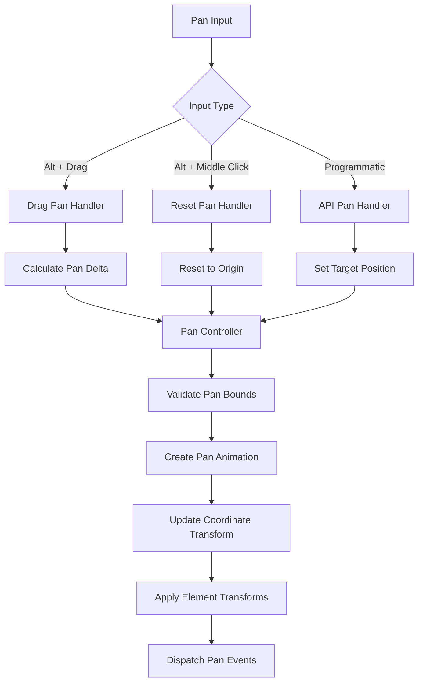

# Design Document

## Overview

The Panning Controls feature will provide comprehensive panning functionality for BJSUI by implementing smooth pan operations with Alt+drag interactions, keyboard shortcuts, and programmatic controls. The design creates a layered panning system with container-specific pan areas, smooth animations, coordinate translation, and proper integration with existing layout and positioning systems while maintaining 60fps performance during pan operations.

## Architecture

### Core Components

#### PanControlService
The main service responsible for pan management and coordination.

```typescript
interface PanControlService {
  enablePan(container: DomElement, config: PanConfig): PanController;
  handlePanInput(controller: PanController, input: PanInput): void;
  setPanPosition(controller: PanController, position: Vector2, animate?: boolean): void;
  resetPan(controller: PanController, animate?: boolean): void;
  getPanState(controller: PanController): PanState;
}
```

#### PanController
Manages pan state and operations for individual containers.

```typescript
interface PanController {
  container: DomElement;
  config: PanConfig;
  state: PanState;
  animation?: PanAnimation;
  eventDispatcher: PanEventDispatcher;
  coordinateTransform: PanCoordinateTransform;
  dragHandler: PanDragHandler;
}
```

#### PanAnimator
Handles smooth pan transitions and animations.

```typescript
interface PanAnimator {
  animatePan(controller: PanController, targetPosition: Vector2, duration: number): Promise<void>;
  updatePanAnimation(controller: PanController, deltaTime: number): void;
  cancelPanAnimation(controller: PanController): void;
  createEasingFunction(type: EasingType): (t: number) => number;
}
```

#### PanCoordinateTransform
Manages coordinate system transformations during pan operations.

```typescript
interface PanCoordinateTransform {
  applyPanTransform(element: DomElement, panPosition: Vector2): void;
  screenToWorld(screenPoint: Vector2, panPosition: Vector2): Vector2;
  worldToScreen(worldPoint: Vector2, panPosition: Vector2): Vector2;
  updateElementTransforms(container: DomElement, panState: PanState): void;
}
```

### Pan System Architecture



## Components and Interfaces

### PanConfig
Configuration for pan behavior:

```typescript
interface PanConfig {
  enabled: boolean;
  bounds: PanBounds;
  animationDuration: number;
  easingType: EasingType;
  dragSensitivity: number;
  constrainToContainer: boolean;
  inertia: boolean;
  inertiaDecay: number;
}

interface PanBounds {
  minX: number;
  maxX: number;
  minY: number;
  maxY: number;
  constrainToBounds: boolean;
}
```

### PanState
Current pan state information:

```typescript
interface PanState {
  position: Vector2;
  velocity: Vector2;
  bounds: PanBounds;
  isAnimating: boolean;
  isDragging: boolean;
  lastUpdate: number;
}
```

### PanAnimation
Animation state for smooth pan transitions:

```typescript
interface PanAnimation {
  startPosition: Vector2;
  targetPosition: Vector2;
  startTime: number;
  duration: number;
  easingFunction: (t: number) => number;
  onComplete?: () => void;
  onUpdate?: (currentPosition: Vector2) => void;
}
```

### PanInput
Input event data for pan operations:

```typescript
interface PanInput {
  type: PanInputType;
  delta?: Vector2;
  position?: Vector2;
  targetPosition?: Vector2;
  animate?: boolean;
}

enum PanInputType {
  Drag = 'drag',
  Reset = 'reset',
  Programmatic = 'programmatic',
  Inertia = 'inertia'
}
```

## Data Models

### PanEvent
Event data for pan state changes:

```typescript
interface PanEvent {
  type: PanEventType;
  controller: PanController;
  previousPosition: Vector2;
  currentPosition: Vector2;
  delta: Vector2;
  timestamp: number;
}

enum PanEventType {
  PanStart = 'panStart',
  PanUpdate = 'panUpdate',
  PanEnd = 'panEnd',
  PanReset = 'panReset'
}
```

### PanDragState
State management for drag operations:

```typescript
interface PanDragState {
  isDragging: boolean;
  startPosition: Vector2;
  currentPosition: Vector2;
  lastPosition: Vector2;
  velocity: Vector2;
  startTime: number;
}
```

## Implementation Strategy

### Alt+Drag Pan Implementation

```typescript
class PanDragHandler {
  private dragState: PanDragState | null = null;
  
  handlePointerDown(event: PointerEvent, controller: PanController): void {
    // Check if Alt/Option is pressed
    if (!event.altKey) return;
    
    // Prevent default behavior
    event.preventDefault();
    
    // Initialize drag state
    this.dragState = {
      isDragging: true,
      startPosition: new Vector2(event.clientX, event.clientY),
      currentPosition: new Vector2(event.clientX, event.clientY),
      lastPosition: new Vector2(event.clientX, event.clientY),
      velocity: Vector2.Zero(),
      startTime: performance.now()
    };
    
    // Dispatch pan start event
    controller.eventDispatcher.dispatch({
      type: PanEventType.PanStart,
      controller,
      previousPosition: controller.state.position.clone(),
      currentPosition: controller.state.position.clone(),
      delta: Vector2.Zero(),
      timestamp: performance.now()
    });
  }
  
  handlePointerMove(event: PointerEvent, controller: PanController): void {
    if (!this.dragState?.isDragging || !event.altKey) return;
    
    const currentPosition = new Vector2(event.clientX, event.clientY);
    const delta = currentPosition.subtract(this.dragState.lastPosition);
    
    // Apply drag sensitivity
    const scaledDelta = delta.scale(controller.config.dragSensitivity);
    
    // Calculate new pan position
    const newPanPosition = controller.state.position.add(scaledDelta);
    const constrainedPosition = this.constrainToBounds(newPanPosition, controller.config.bounds);
    
    // Update pan position
    this.panControlService.setPanPosition(controller, constrainedPosition, false);
    
    // Update drag state
    this.dragState.lastPosition = currentPosition;
    this.dragState.currentPosition = currentPosition;
    this.dragState.velocity = scaledDelta;
  }
  
  handlePointerUp(event: PointerEvent, controller: PanController): void {
    if (!this.dragState?.isDragging) return;
    
    // Apply inertia if enabled
    if (controller.config.inertia && this.dragState.velocity.length() > 0.1) {
      this.applyInertia(controller, this.dragState.velocity);
    }
    
    // Clean up drag state
    this.dragState = null;
    
    // Dispatch pan end event
    controller.eventDispatcher.dispatch({
      type: PanEventType.PanEnd,
      controller,
      previousPosition: controller.state.position.clone(),
      currentPosition: controller.state.position.clone(),
      delta: Vector2.Zero(),
      timestamp: performance.now()
    });
  }
}
```

### Pan Animation Implementation

```typescript
class PanAnimator {
  animatePan(controller: PanController, targetPosition: Vector2, duration: number): Promise<void> {
    return new Promise((resolve) => {
      const animation: PanAnimation = {
        startPosition: controller.state.position.clone(),
        targetPosition: this.constrainToBounds(targetPosition, controller.config.bounds),
        startTime: performance.now(),
        duration,
        easingFunction: this.createEasingFunction(controller.config.easingType),
        onComplete: resolve
      };
      
      controller.animation = animation;
      this.startAnimationLoop(controller);
    });
  }
  
  private startAnimationLoop(controller: PanController): void {
    const animate = () => {
      if (!controller.animation) return;
      
      const elapsed = performance.now() - controller.animation.startTime;
      const progress = Math.min(elapsed / controller.animation.duration, 1);
      const easedProgress = controller.animation.easingFunction(progress);
      
      const currentPosition = Vector2.Lerp(
        controller.animation.startPosition,
        controller.animation.targetPosition,
        easedProgress
      );
      
      this.applyPanPosition(controller, currentPosition);
      
      if (progress < 1) {
        requestAnimationFrame(animate);
      } else {
        this.completeAnimation(controller);
      }
    };
    
    requestAnimationFrame(animate);
  }
}
```

### Coordinate Transform Implementation

```typescript
class PanCoordinateTransform {
  applyPanTransform(element: DomElement, panPosition: Vector2): void {
    // Apply pan offset to element position
    const originalPosition = element.originalPosition || element.mesh.position.clone();
    
    element.mesh.position.x = originalPosition.x + panPosition.x;
    element.mesh.position.y = originalPosition.y + panPosition.y;
    
    // Update child elements recursively
    for (const child of element.children) {
      this.applyPanTransform(child, panPosition);
    }
  }
  
  screenToWorld(screenPoint: Vector2, panPosition: Vector2): Vector2 {
    return screenPoint.subtract(panPosition);
  }
  
  worldToScreen(worldPoint: Vector2, panPosition: Vector2): Vector2 {
    return worldPoint.add(panPosition);
  }
  
  updateElementTransforms(container: DomElement, panState: PanState): void {
    // Store original positions if not already stored
    this.storeOriginalPositions(container);
    
    // Apply pan transform to all elements in container
    this.applyPanTransform(container, panState.position);
  }
  
  private storeOriginalPositions(element: DomElement): void {
    if (!element.originalPosition) {
      element.originalPosition = element.mesh.position.clone();
    }
    
    for (const child of element.children) {
      this.storeOriginalPositions(child);
    }
  }
}
```

### Programmatic Pan API

```typescript
class PanAPI {
  setPan(controller: PanController, position: Vector2, animate: boolean = true): void {
    const constrainedPosition = this.constrainToBounds(position, controller.config.bounds);
    
    if (animate) {
      this.panAnimator.animatePan(controller, constrainedPosition, controller.config.animationDuration);
    } else {
      this.applyPanPosition(controller, constrainedPosition);
    }
  }
  
  panBy(controller: PanController, delta: Vector2, animate: boolean = true): void {
    const newPosition = controller.state.position.add(delta);
    this.setPan(controller, newPosition, animate);
  }
  
  panTo(controller: PanController, element: DomElement, animate: boolean = true): void {
    const elementBounds = this.getElementBounds(element);
    const containerBounds = this.getContainerBounds(controller.container);
    
    // Calculate position to center element in viewport
    const targetPosition = new Vector2(
      (containerBounds.width - elementBounds.width) / 2 - elementBounds.x,
      (containerBounds.height - elementBounds.height) / 2 - elementBounds.y
    );
    
    this.setPan(controller, targetPosition, animate);
  }
  
  resetPan(controller: PanController, animate: boolean = true): void {
    this.setPan(controller, Vector2.Zero(), animate);
  }
  
  getPanState(controller: PanController): PanState {
    return {
      position: controller.state.position.clone(),
      velocity: controller.state.velocity.clone(),
      bounds: { ...controller.config.bounds },
      isAnimating: !!controller.animation,
      isDragging: controller.state.isDragging,
      lastUpdate: controller.state.lastUpdate
    };
  }
}
```

## Integration Points

### BabylonDomService Extension
Integration with existing DOM element creation:

```typescript
// In babylon-dom.service.ts
private handlePannableElement(element: DomElement): void {
  const panConfig = this.parsePanConfig(element.style);
  
  if (panConfig.enabled) {
    const panController = this.panControlService.enablePan(element, panConfig);
    element.panController = panController;
    
    // Set up pan event listeners
    this.setupPanEventListeners(element);
  }
}
```

### Event System Integration
Coordination with existing interaction systems:

```typescript
// In event handling
private handlePanInteraction(event: InteractionEvent): void {
  const element = this.findPannableContainer(event.target);
  
  if (element?.panController) {
    switch (event.type) {
      case 'pointerdown':
        if (event.altKey) {
          this.panControlService.handlePanInput(element.panController, {
            type: PanInputType.Drag,
            position: this.getEventPosition(event)
          });
          event.preventDefault();
        }
        break;
      case 'auxclick':
        if (event.altKey && event.button === 1) {
          this.panControlService.resetPan(element.panController, true);
          event.preventDefault();
        }
        break;
    }
  }
}
```

## Performance Optimizations

### Transform Caching
- Cache original element positions to avoid recalculation
- Use efficient vector operations for coordinate transforms
- Implement incremental updates for small pan changes

### Animation Optimization
- Use requestAnimationFrame for smooth 60fps animations
- Implement animation culling for off-screen elements
- Provide performance fallbacks for low-end devices

### Memory Management
- Clean up pan controllers for removed elements
- Dispose animation resources properly
- Optimize coordinate transform calculations

## Error Handling

### Pan Boundary Management
- Constrain pan values to configured boundary limits
- Handle edge cases with infinite or invalid pan bounds
- Provide graceful fallbacks for invalid pan operations

### Animation Conflicts
- Handle overlapping pan animations gracefully
- Resolve conflicts between user input and programmatic pan
- Manage animation state during rapid pan changes

### Performance Issues
- Monitor pan performance and provide fallbacks
- Implement automatic quality reduction for complex scenes
- Provide configuration options for performance tuning

```typescript
interface PanErrorHandler {
  handlePanBoundaryError(controller: PanController, attemptedPosition: Vector2): Vector2;
  handleAnimationConflict(controller: PanController, newAnimation: PanAnimation): void;
  handlePerformanceIssue(controller: PanController): void;
}
```

## Testing Strategy

### Visual Test Sites
Test sites will be created in `site-data.service.ts` to validate pan functionality:

1. **Basic Pan Controls**: Alt+drag panning with smooth movement
2. **Pan Reset**: Alt+middle click pan reset to origin
3. **Container-Specific Pan**: Different pan settings for nested containers
4. **Pan Constraints**: Boundary limits and constrained pan areas
5. **Programmatic Pan**: API-driven pan operations and state management
6. **Pan with Interactions**: Pan behavior with hover states and click events
7. **Performance Test**: Pan with large numbers of elements

### Expected Visual Outcomes
Each test site will include documentation of expected pan behavior, animation smoothness, and performance characteristics.

## Dependencies

### Browser APIs
- Pointer Events API for Alt+drag detection
- Pointer Events API for middle click detection
- RequestAnimationFrame for smooth animations

### BabylonJS Features
- Mesh positioning for pan transforms
- Scene coordinate system management
- Animation system integration

### Existing BJSUI Services
- BabylonDomService: DOM element integration
- BabylonMeshService: Mesh transformation management
- Event system: Input event handling and processing
- Camera service: Viewport and coordinate system management

## Future Enhancements

### Advanced Pan Features
- Touch gesture support for pan operations
- Pan with momentum and physics-based deceleration
- Multi-touch pan center calculation

### Pan UI Controls
- Visual pan controls (directional arrows)
- Pan position indicator and minimap
- Pan presets and bookmarks

### Integration Features
- Pan state persistence across sessions
- Pan synchronization between multiple views
- Pan-aware layout and responsive design