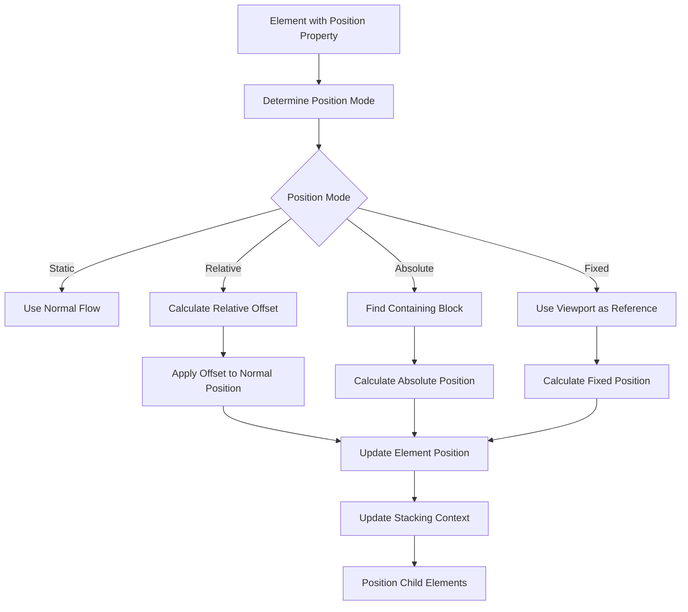

# Design Document

## Overview

The Positioning Modes feature will extend BJSUI's layout system to support CSS positioning properties (`position: relative`, `position: absolute`, `position: fixed`) in 3D space. This design introduces different coordinate calculation strategies and positioning contexts while maintaining integration with existing layout systems. The implementation will create a hierarchical positioning system that respects containing blocks, stacking contexts, and coordinate transformations.

## Architecture

### Core Components

#### PositioningService
The main service responsible for positioning calculations and coordinate transformations.

```typescript
interface PositioningService {
  calculatePosition(element: DomElement, positionMode: PositionMode): PositionData;
  establishContainingBlock(element: DomElement): ContainingBlock;
  resolvePositionValues(element: DomElement, containingBlock: ContainingBlock): ResolvedPosition;
  updatePositionedElement(element: DomElement, newPosition: PositionData): void;
  getStackingContext(element: DomElement): StackingContext;
}
```

#### ContainingBlockManager
Manages containing block relationships and coordinate system transformations.

```typescript
interface ContainingBlockManager {
  findContainingBlock(element: DomElement): ContainingBlock;
  createContainingBlock(element: DomElement): ContainingBlock;
  updateContainingBlockDimensions(containingBlock: ContainingBlock): void;
  getCoordinateTransform(from: ContainingBlock, to: ContainingBlock): TransformMatrix;
}
```

#### PositionCalculator
Handles the mathematical calculations for different positioning modes.

```typescript
interface PositionCalculator {
  calculateRelativePosition(element: DomElement, offsets: PositionOffsets): Vector3;
  calculateAbsolutePosition(element: DomElement, containingBlock: ContainingBlock, offsets: PositionOffsets): Vector3;
  calculateFixedPosition(element: DomElement, viewport: ViewportData, offsets: PositionOffsets): Vector3;
  resolvePercentageValues(values: PositionOffsets, containingBlock: ContainingBlock): PositionOffsets;
}
```

### Position Mode Types

```typescript
enum PositionMode {
  Static = 'static',      // Default - normal flow
  Relative = 'relative',  // Offset from normal position
  Absolute = 'absolute',  // Positioned relative to containing block
  Fixed = 'fixed'         // Positioned relative to viewport
}

interface PositionOffsets {
  top?: string | number;
  right?: string | number;
  bottom?: string | number;
  left?: string | number;
}
```

## Components and Interfaces

### PositionData
Core data structure for element positioning information:

```typescript
interface PositionData {
  mode: PositionMode;
  offsets: PositionOffsets;
  resolvedPosition: Vector3;
  containingBlock: ContainingBlock;
  stackingContext?: StackingContext;
  establishesContainingBlock: boolean;
}
```

### Integration with Existing StyleRule
The StyleRule interface already includes positioning properties:
- `top`, `left`, `right`, `bottom` - positioning offset values
- `zIndex` - stacking order value
- `position` - positioning mode (added for this feature)

### ContainingBlock
Represents the coordinate system reference for positioned elements:

```typescript
interface ContainingBlock {
  element: DomElement;
  dimensions: {
    width: number;
    height: number;
    contentWidth: number;
    contentHeight: number;
  };
  position: Vector3;
  transform?: TransformMatrix;
  isViewport: boolean;
}
```

### StackingContext
Manages z-index layering for positioned elements:

```typescript
interface StackingContext {
  element: DomElement;
  zIndex: number;
  children: StackingContext[];
  parent?: StackingContext;
  establishedBy: 'position' | 'zIndex' | 'transform' | 'opacity';
}
```

## Data Models

### PositionedElement
Extension of DomElement for positioning-specific properties:

```typescript
interface PositionedElement extends DomElement {
  positionMode: PositionMode;
  positionOffsets: PositionOffsets;
  positionData?: PositionData;
  containingBlock?: ContainingBlock;
  establishesContainingBlock: boolean;
  stackingContext?: StackingContext;
}
```

### ViewportData
Information about the current viewport for fixed positioning:

```typescript
interface ViewportData {
  width: number;
  height: number;
  position: Vector3;
  cameraTransform: TransformMatrix;
  scale: number;
}
```

## Implementation Strategy

### Positioning Algorithm Flow



### Relative Positioning Implementation

```typescript
class RelativePositioning {
  calculateRelativePosition(element: DomElement, offsets: PositionOffsets): Vector3 {
    // Get the element's normal flow position
    const normalPosition = this.layoutService.calculateNormalFlowPosition(element);
    
    // Calculate offsets
    const resolvedOffsets = this.resolveOffsetValues(offsets, element.parent);
    
    // Apply offsets to normal position
    return new Vector3(
      normalPosition.x + (resolvedOffsets.left || 0) - (resolvedOffsets.right || 0),
      normalPosition.y + (resolvedOffsets.top || 0) - (resolvedOffsets.bottom || 0),
      normalPosition.z
    );
  }
}
```

### Absolute Positioning Implementation

```typescript
class AbsolutePositioning {
  calculateAbsolutePosition(element: DomElement, containingBlock: ContainingBlock, offsets: PositionOffsets): Vector3 {
    const resolvedOffsets = this.resolvePercentageValues(offsets, containingBlock);
    
    let x = containingBlock.position.x;
    let y = containingBlock.position.y;
    
    // Handle horizontal positioning
    if (resolvedOffsets.left !== undefined) {
      x += resolvedOffsets.left;
    } else if (resolvedOffsets.right !== undefined) {
      x += containingBlock.dimensions.contentWidth - element.dimensions.width - resolvedOffsets.right;
    }
    
    // Handle vertical positioning
    if (resolvedOffsets.top !== undefined) {
      y += resolvedOffsets.top;
    } else if (resolvedOffsets.bottom !== undefined) {
      y += containingBlock.dimensions.contentHeight - element.dimensions.height - resolvedOffsets.bottom;
    }
    
    return new Vector3(x, y, containingBlock.position.z);
  }
}
```

### Fixed Positioning Implementation

```typescript
class FixedPositioning {
  calculateFixedPosition(element: DomElement, viewport: ViewportData, offsets: PositionOffsets): Vector3 {
    const resolvedOffsets = this.resolveViewportValues(offsets, viewport);
    
    let x = viewport.position.x;
    let y = viewport.position.y;
    
    // Handle horizontal positioning relative to viewport
    if (resolvedOffsets.left !== undefined) {
      x += resolvedOffsets.left;
    } else if (resolvedOffsets.right !== undefined) {
      x += viewport.width - element.dimensions.width - resolvedOffsets.right;
    }
    
    // Handle vertical positioning relative to viewport
    if (resolvedOffsets.top !== undefined) {
      y += resolvedOffsets.top;
    } else if (resolvedOffsets.bottom !== undefined) {
      y += viewport.height - element.dimensions.height - resolvedOffsets.bottom;
    }
    
    return new Vector3(x, y, viewport.position.z);
  }
}
```

## Integration Points

### BabylonDomService Extension
Integration with existing DOM element creation and layout:

```typescript
// In babylon-dom.service.ts
private handlePositionedElement(element: DomElement): void {
  const positionMode = this.getPositionMode(element);
  
  if (positionMode !== PositionMode.Static) {
    const positionData = this.positioningService.calculatePosition(element, positionMode);
    this.applyPositioning(element, positionData);
    
    if (positionData.establishesContainingBlock) {
      this.containingBlockManager.createContainingBlock(element);
    }
  }
}
```

### Layout Service Integration
Coordination with existing layout systems:

```typescript
// In layout calculations
private calculateElementPosition(element: DomElement): Vector3 {
  const positionMode = element.style.position || PositionMode.Static;
  
  switch (positionMode) {
    case PositionMode.Static:
      return this.calculateNormalFlowPosition(element);
    case PositionMode.Relative:
      return this.positioningService.calculateRelativePosition(element);
    case PositionMode.Absolute:
      return this.positioningService.calculateAbsolutePosition(element);
    case PositionMode.Fixed:
      return this.positioningService.calculateFixedPosition(element);
  }
}
```

## Containing Block Resolution

### Containing Block Algorithm

```typescript
class ContainingBlockResolver {
  findContainingBlock(element: DomElement): ContainingBlock {
    let ancestor = element.parent;
    
    while (ancestor) {
      // Check if ancestor establishes a containing block
      if (this.establishesContainingBlock(ancestor)) {
        return this.createContainingBlock(ancestor);
      }
      ancestor = ancestor.parent;
    }
    
    // If no positioned ancestor found, use initial containing block (viewport)
    return this.createViewportContainingBlock();
  }
  
  private establishesContainingBlock(element: DomElement): boolean {
    const position = element.style.position;
    return position === 'relative' || position === 'absolute' || position === 'fixed' ||
           element.style.transform !== undefined ||
           element.style.perspective !== undefined;
  }
}
```

## Stacking Context Management

### Z-Index and Layering

```typescript
class StackingContextManager {
  createStackingContext(element: DomElement): StackingContext {
    const context: StackingContext = {
      element,
      zIndex: this.parseZIndex(element.style.zIndex),
      children: [],
      establishedBy: this.determineStackingReason(element)
    };
    
    this.insertIntoStackingOrder(context);
    return context;
  }
  
  private determineStackingReason(element: DomElement): string {
    if (element.style.position !== 'static' && element.style.zIndex !== 'auto') {
      return 'position';
    }
    if (element.style.transform !== undefined) {
      return 'transform';
    }
    if (element.style.opacity !== undefined && element.style.opacity < 1) {
      return 'opacity';
    }
    return 'zIndex';
  }
}
```

## Error Handling

### Position Calculation Errors
- Handle invalid position values gracefully
- Provide fallback to static positioning for errors
- Log warnings for unsupported position combinations

### Containing Block Errors
- Handle circular containing block references
- Manage missing or invalid containing blocks
- Provide viewport fallback for resolution failures

### Performance Considerations
- Cache containing block calculations
- Optimize position recalculation for dynamic content
- Implement efficient stacking context updates

```typescript
interface PositioningErrorHandler {
  handleInvalidPositionValue(element: DomElement, property: string, value: string): void;
  handleContainingBlockError(element: DomElement, error: Error): ContainingBlock;
  handleStackingContextError(element: DomElement, error: Error): StackingContext;
}
```

## Performance Optimizations

### Calculation Caching
- Cache containing block relationships
- Store resolved position values
- Implement incremental updates for position changes

### Batch Updates
- Group position calculations for multiple elements
- Optimize stacking context updates
- Minimize mesh position updates

### Memory Management
- Clean up unused containing blocks
- Dispose of stacking contexts for removed elements
- Optimize coordinate transformation matrices

## Testing Strategy

### Visual Test Sites
Test sites will be created in `site-data.service.ts` to validate positioning:

1. **Relative Positioning**: Elements with various relative offsets
2. **Absolute Positioning**: Elements positioned relative to different containing blocks
3. **Fixed Positioning**: Elements that remain fixed during camera movement
4. **Mixed Positioning**: Combinations of different positioning modes
5. **Nested Positioning**: Complex hierarchies with multiple containing blocks
6. **Stacking Contexts**: Z-index layering with positioned elements
7. **Responsive Positioning**: Percentage-based positioning with container changes

### Expected Visual Outcomes
Each test site will include documentation of expected positioning behavior and visual appearance.

## Dependencies

### Existing BJSUI Services
- BabylonDomService: DOM element management
- BabylonMeshService: Mesh positioning and updates
- BabylonCameraService: Viewport information for fixed positioning
- Layout services: Integration with flexbox and grid systems

### BabylonJS Features
- Mesh positioning and transformation
- Scene graph management
- Camera and viewport information
- Coordinate system transformations

### New Services
- PositioningService: Core positioning calculations
- ContainingBlockManager: Containing block management
- StackingContextManager: Z-index and layering management