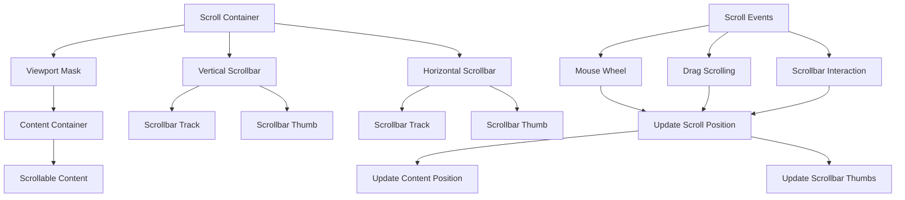

# Design Document

## Overview

The Scroll Areas feature will provide comprehensive scrolling capabilities for BJSUI by implementing scrollable containers with visual scrollbars, mouse wheel support, drag scrolling, and virtual scrolling for performance. The design creates a layered scrolling system with viewport management, content positioning, and interactive scrollbar controls rendered as 3D elements. The implementation focuses on maintaining 60fps performance while providing smooth, responsive scrolling experiences.

## Architecture

### Core Components

#### ScrollAreaService
The main service responsible for scroll area management and coordination.

```typescript
interface ScrollAreaService {
  createScrollArea(element: DomElement, overflowMode: OverflowMode): ScrollArea;
  updateScrollPosition(scrollArea: ScrollArea, position: ScrollPosition): void;
  handleScrollEvent(scrollArea: ScrollArea, event: ScrollEvent): void;
  calculateScrollBounds(scrollArea: ScrollArea): ScrollBounds;
  disposeScrollArea(scrollArea: ScrollArea): void;
}
```

#### ScrollViewport
Manages the visible area and content clipping for scrollable containers.

```typescript
interface ScrollViewport {
  element: DomElement;
  dimensions: ViewportDimensions;
  contentSize: ContentSize;
  scrollPosition: ScrollPosition;
  clipMask?: BABYLON.Mesh;
  contentContainer: BABYLON.TransformNode;
}
```

#### ScrollbarRenderer
Handles the creation and management of visual scrollbars.

```typescript
interface ScrollbarRenderer {
  createScrollbars(scrollArea: ScrollArea): ScrollbarSet;
  updateScrollbarPosition(scrollbar: Scrollbar, position: number): void;
  handleScrollbarInteraction(scrollbar: Scrollbar, interaction: ScrollbarInteraction): void;
  styleScrollbar(scrollbar: Scrollbar, style: ScrollbarStyle): void;
}
```

#### VirtualScrollManager
Manages virtual scrolling for large datasets.

```typescript
interface VirtualScrollManager {
  createVirtualScroll(scrollArea: ScrollArea, itemHeight: number, totalItems: number): VirtualScroll;
  updateVisibleItems(virtualScroll: VirtualScroll, scrollPosition: number): void;
  calculateVirtualBounds(virtualScroll: VirtualScroll): VirtualBounds;
  handleVirtualScrollUpdate(virtualScroll: VirtualScroll): void;
}
```

### Scroll Area Architecture



## Components and Interfaces

### ScrollArea
Core data structure for scrollable containers:

```typescript
interface ScrollArea {
  element: DomElement;
  viewport: ScrollViewport;
  scrollbars: ScrollbarSet;
  overflowMode: OverflowMode;
  scrollPosition: ScrollPosition;
  scrollBounds: ScrollBounds;
  virtualScroll?: VirtualScroll;
  interactions: ScrollInteractionManager;
}

enum OverflowMode {
  Visible = 'visible',
  Hidden = 'hidden',
  Scroll = 'scroll',
  Auto = 'auto'
}
```

### ScrollPosition
Represents current scroll state:

```typescript
interface ScrollPosition {
  x: number;
  y: number;
  maxX: number;
  maxY: number;
  percentageX: number;
  percentageY: number;
}
```

### ScrollbarSet
Collection of scrollbar components:

```typescript
interface ScrollbarSet {
  vertical?: Scrollbar;
  horizontal?: Scrollbar;
  corner?: BABYLON.Mesh; // Corner piece where scrollbars meet
}

interface Scrollbar {
  track: BABYLON.Mesh;
  thumb: BABYLON.Mesh;
  direction: 'horizontal' | 'vertical';
  size: number;
  position: number;
  visible: boolean;
  interactive: boolean;
}
```

### VirtualScroll
Virtual scrolling configuration and state:

```typescript
interface VirtualScroll {
  itemHeight: number;
  totalItems: number;
  visibleItems: number;
  bufferSize: number;
  startIndex: number;
  endIndex: number;
  renderedItems: Map<number, DomElement>;
  itemRenderer: (index: number) => DomElement;
}
```

## Data Models

### ScrollEvent
Event data for scroll interactions:

```typescript
interface ScrollEvent {
  type: 'wheel' | 'drag' | 'scrollbar' | 'programmatic';
  deltaX: number;
  deltaY: number;
  position: ScrollPosition;
  target: ScrollArea;
  originalEvent?: Event;
}
```

### ScrollBounds
Defines scrollable area limits:

```typescript
interface ScrollBounds {
  minX: number;
  maxX: number;
  minY: number;
  maxY: number;
  contentWidth: number;
  contentHeight: number;
  viewportWidth: number;
  viewportHeight: number;
}
```

### ScrollbarStyle
Styling configuration for scrollbars:

```typescript
interface ScrollbarStyle {
  trackColor: string;
  thumbColor: string;
  thumbHoverColor: string;
  trackWidth: number;
  thumbMinSize: number;
  borderRadius: number;
  opacity: number;
}
```

## Implementation Strategy

### Viewport Clipping Implementation

The scroll area uses a clipping mask to hide content outside the viewport:

```typescript
class ViewportClipper {
  createClipMask(viewport: ScrollViewport): BABYLON.Mesh {
    const clipPlane = BABYLON.MeshBuilder.CreatePlane("clipMask", {
      width: viewport.dimensions.width,
      height: viewport.dimensions.height
    }, this.scene);
    
    // Create stencil material for clipping
    const clipMaterial = new BABYLON.StandardMaterial("clipMaterial", this.scene);
    clipMaterial.disableColorWrite = true;
    clipPlane.material = clipMaterial;
    
    return clipPlane;
  }
  
  updateClipBounds(viewport: ScrollViewport, scrollPosition: ScrollPosition): void {
    // Update content container position to simulate scrolling
    viewport.contentContainer.position.x = -scrollPosition.x;
    viewport.contentContainer.position.y = scrollPosition.y; // Inverted for screen coordinates
  }
}
```

### Mouse Wheel Scrolling

```typescript
class MouseWheelHandler {
  handleWheelEvent(event: WheelEvent, scrollArea: ScrollArea): void {
    const deltaX = event.shiftKey ? event.deltaY : event.deltaX;
    const deltaY = event.shiftKey ? 0 : event.deltaY;
    
    const scrollSpeed = this.getScrollSpeed();
    const newPosition = {
      x: Math.max(0, Math.min(scrollArea.scrollBounds.maxX, scrollArea.scrollPosition.x + deltaX * scrollSpeed)),
      y: Math.max(0, Math.min(scrollArea.scrollBounds.maxY, scrollArea.scrollPosition.y + deltaY * scrollSpeed))
    };
    
    this.scrollAreaService.updateScrollPosition(scrollArea, newPosition);
    event.preventDefault();
  }
}
```

### Drag Scrolling Implementation

```typescript
class DragScrollHandler {
  private isDragging = false;
  private lastDragPosition: Vector2;
  
  handlePointerDown(event: PointerEvent, scrollArea: ScrollArea): void {
    this.isDragging = true;
    this.lastDragPosition = new Vector2(event.clientX, event.clientY);
    
    // Temporarily disable other interactions
    this.disableContentInteractions(scrollArea);
  }
  
  handlePointerMove(event: PointerEvent, scrollArea: ScrollArea): void {
    if (!this.isDragging) return;
    
    const currentPosition = new Vector2(event.clientX, event.clientY);
    const delta = currentPosition.subtract(this.lastDragPosition);
    
    const newScrollPosition = {
      x: Math.max(0, Math.min(scrollArea.scrollBounds.maxX, scrollArea.scrollPosition.x - delta.x)),
      y: Math.max(0, Math.min(scrollArea.scrollBounds.maxY, scrollArea.scrollPosition.y + delta.y))
    };
    
    this.scrollAreaService.updateScrollPosition(scrollArea, newScrollPosition);
    this.lastDragPosition = currentPosition;
  }
}
```

### Virtual Scrolling Implementation

```typescript
class VirtualScrollRenderer {
  updateVisibleItems(virtualScroll: VirtualScroll, scrollPosition: number): void {
    const itemHeight = virtualScroll.itemHeight;
    const viewportHeight = virtualScroll.viewportHeight;
    
    // Calculate visible range with buffer
    const startIndex = Math.max(0, Math.floor(scrollPosition / itemHeight) - virtualScroll.bufferSize);
    const endIndex = Math.min(virtualScroll.totalItems - 1, 
      Math.ceil((scrollPosition + viewportHeight) / itemHeight) + virtualScroll.bufferSize);
    
    // Remove items outside visible range
    for (const [index, item] of virtualScroll.renderedItems) {
      if (index < startIndex || index > endIndex) {
        this.disposeVirtualItem(item);
        virtualScroll.renderedItems.delete(index);
      }
    }
    
    // Add new visible items
    for (let i = startIndex; i <= endIndex; i++) {
      if (!virtualScroll.renderedItems.has(i)) {
        const item = virtualScroll.itemRenderer(i);
        item.position.y = i * itemHeight;
        virtualScroll.renderedItems.set(i, item);
      }
    }
  }
}
```

## Integration Points

### BabylonDomService Extension
Integration with existing DOM element creation:

```typescript
// In babylon-dom.service.ts
private handleScrollableElement(element: DomElement): void {
  const overflowX = element.style.overflowX || element.style.overflow;
  const overflowY = element.style.overflowY || element.style.overflow;
  
  if (this.isScrollable(overflowX, overflowY)) {
    const scrollArea = this.scrollAreaService.createScrollArea(element, {
      x: overflowX,
      y: overflowY
    });
    element.scrollArea = scrollArea;
  }
}
```

### Event System Integration
Coordination with existing interaction systems:

```typescript
// In event handling
private handleElementInteraction(event: InteractionEvent): void {
  const element = event.target;
  
  if (element.scrollArea && this.isScrollEvent(event)) {
    this.scrollAreaService.handleScrollEvent(element.scrollArea, event);
    return; // Prevent other interactions during scrolling
  }
  
  // Continue with normal interaction handling
  this.processNormalInteraction(event);
}
```

## Scrollbar Rendering

### 3D Scrollbar Creation

```typescript
class ScrollbarRenderer {
  createVerticalScrollbar(scrollArea: ScrollArea): Scrollbar {
    const trackHeight = scrollArea.viewport.dimensions.height;
    const trackWidth = this.scrollbarStyle.trackWidth;
    
    // Create scrollbar track
    const track = BABYLON.MeshBuilder.CreateBox("scrollbarTrack", {
      width: trackWidth,
      height: trackHeight,
      depth: 0.1
    }, this.scene);
    
    // Position track at right edge of viewport
    track.position.x = scrollArea.viewport.dimensions.width / 2 + trackWidth / 2;
    track.position.y = 0;
    
    // Create scrollbar thumb
    const thumbHeight = this.calculateThumbSize(scrollArea, 'vertical');
    const thumb = BABYLON.MeshBuilder.CreateBox("scrollbarThumb", {
      width: trackWidth * 0.8,
      height: thumbHeight,
      depth: 0.2
    }, this.scene);
    
    // Apply materials
    this.applyScrollbarMaterials(track, thumb);
    
    return {
      track,
      thumb,
      direction: 'vertical',
      size: thumbHeight,
      position: 0,
      visible: true,
      interactive: true
    };
  }
}
```

## Performance Optimizations

### Scroll Position Caching
- Cache scroll calculations to avoid redundant computations
- Implement incremental updates for small scroll changes
- Use requestAnimationFrame for smooth scroll animations

### Content Culling
- Hide content outside viewport bounds
- Implement frustum culling for 3D scroll content
- Use level-of-detail for distant scrollable content

### Virtual Scrolling Optimizations
- Implement object pooling for virtual scroll items
- Use efficient data structures for item tracking
- Optimize item creation and disposal cycles

### Memory Management
- Dispose unused scroll area resources
- Clean up event listeners and interactions
- Manage texture resources for scrollbar styling

## Error Handling

### Scroll Boundary Management
- Prevent scrolling beyond content boundaries
- Handle edge cases with zero or negative content sizes
- Provide graceful fallbacks for invalid scroll positions

### Performance Degradation
- Monitor scroll performance and provide fallbacks
- Implement automatic virtual scrolling for large content
- Provide configuration options for performance tuning

### Interaction Conflicts
- Resolve conflicts between scroll and element interactions
- Handle overlapping scrollable areas
- Manage event propagation for nested scroll areas

```typescript
interface ScrollErrorHandler {
  handleScrollBoundaryError(scrollArea: ScrollArea, position: ScrollPosition): ScrollPosition;
  handlePerformanceIssue(scrollArea: ScrollArea): void;
  handleInteractionConflict(event: InteractionEvent, scrollArea: ScrollArea): boolean;
}
```

## Testing Strategy

### Visual Test Sites
Test sites will be created in `site-data.service.ts` to validate scrolling:

1. **Basic Scrolling**: Simple vertical and horizontal scroll areas
2. **Overflow Modes**: Testing auto vs scroll overflow behavior
3. **Scrollbar Interactions**: Clickable and draggable scrollbars
4. **Mouse Wheel Scrolling**: Wheel scrolling with shift modifier support
5. **Drag Scrolling**: Touch-like drag scrolling within content areas
6. **Virtual Scrolling**: Large datasets with virtual scrolling performance
7. **Nested Scrolling**: Multiple levels of scrollable containers
8. **Styled Scrollbars**: Custom scrollbar appearance and theming

### Expected Visual Outcomes
Each test site will include documentation of expected scrolling behavior, performance characteristics, and visual appearance.

## Dependencies

### Browser APIs
- Pointer Events API for drag scrolling
- Wheel Event API for mouse wheel scrolling
- RequestAnimationFrame for smooth animations

### BabylonJS Features
- Mesh creation and positioning for scrollbars
- Clipping planes or stencil buffers for viewport masking
- Transform nodes for content container management
- Material system for scrollbar styling

### Existing BJSUI Services
- BabylonDomService: DOM element integration
- BabylonMeshService: Mesh creation and management
- Event system: Interaction and pointer event handling
- Style system: Overflow property parsing and application

## Future Enhancements

### Advanced Scrolling Features
- Momentum scrolling with physics-based deceleration
- Snap-to-grid scrolling for structured content
- Infinite scrolling with dynamic content loading

### Accessibility
- Keyboard navigation support for scrollable areas
- Screen reader compatibility for scroll position
- High contrast scrollbar themes

### Mobile Support
- Touch gesture recognition for scroll areas
- Pinch-to-zoom integration with scrolling
- Mobile-optimized scrollbar sizing and behavior