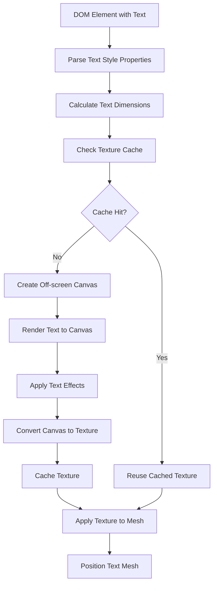

# Design Document

## Overview

The Text Rendering Engine will provide comprehensive text display capabilities for ASTYLARUI by implementing a custom texture-based text rendering system. The design follows an off-screen canvas rendering approach where text is rendered using browser's native text capabilities to a canvas, then transferred as textures to BabylonJS mesh planes. This approach leverages all browser fonts and text features while maintaining full integration with the 3D environment.

**Implementation Note:** During development, if we encounter complex text-related functional problems, we can reference the BabylonJS GUI extensions source code (which is open source) to understand how they solve similar challenges, while still maintaining our custom off-screen rendering approach.

## Architecture

### Core Components

#### TextRenderingService
The main service responsible for text rendering orchestration and texture management.

```typescript
interface TextRenderingService {
  renderTextToTexture(element: DomElement, textContent: string): BABYLON.Texture;
  updateTextTexture(element: DomElement, newContent: string): void;
  calculateTextDimensions(text: string, style: TextStyleProperties): TextDimensions;
  disposeTextTexture(element: DomElement): void;
  cacheTextTexture(key: string, texture: BABYLON.Texture): void;
}
```

#### TextCanvasRenderer
Handles the off-screen canvas rendering of text using browser's native text capabilities.

```typescript
interface TextCanvasRenderer {
  createTextCanvas(dimensions: TextDimensions): HTMLCanvasElement;
  renderTextToCanvas(canvas: HTMLCanvasElement, text: string, style: TextStyleProperties): void;
  applyTextEffects(canvas: HTMLCanvasElement, effects: TextEffects): void;
  measureTextBounds(text: string, style: TextStyleProperties): TextBounds;
}
```

#### TextStyleParser
Parses and processes CSS-like text styling properties.

```typescript
interface TextStyleParser {
  parseTextProperties(styleRule: StyleRule): TextStyleProperties;
  resolveFontFamily(fontFamily: string): string;
  calculateFontSize(fontSize: string, containerSize: number): number;
  parseTextShadow(textShadow: string): TextShadowEffect[];
}
```

### Text Rendering Pipeline



## Components and Interfaces

### TextStyleProperties
Comprehensive text styling interface extending existing style properties:

```typescript
interface TextStyleProperties {
  // Font properties
  fontFamily: string;
  fontSize: number;
  fontWeight: 'normal' | 'bold' | 'bolder' | 'lighter' | number;
  fontStyle: 'normal' | 'italic' | 'oblique';
  
  // Text appearance
  color: string;
  textAlign: 'left' | 'center' | 'right' | 'justify';
  verticalAlign: 'top' | 'middle' | 'bottom' | 'baseline';
  lineHeight: number;
  letterSpacing: number;
  wordSpacing: number;
  
  // Text behavior
  whiteSpace: 'normal' | 'nowrap' | 'pre' | 'pre-wrap' | 'pre-line';
  wordWrap: 'normal' | 'break-word' | 'anywhere';
  textOverflow: 'clip' | 'ellipsis';
  
  // Text effects
  textShadow?: TextShadowEffect[];
  textDecoration: 'none' | 'underline' | 'overline' | 'line-through';
  textTransform: 'none' | 'uppercase' | 'lowercase' | 'capitalize';
  
  // Text stroke (if supported)
  textStroke?: {
    width: number;
    color: string;
  };
}
```

### TextDimensions
Structure for text measurement and layout calculations:

```typescript
interface TextDimensions {
  width: number;
  height: number;
  lineHeight: number;
  baseline: number;
  lines: TextLine[];
  actualBounds: {
    left: number;
    top: number;
    right: number;
    bottom: number;
  };
}

interface TextLine {
  text: string;
  width: number;
  y: number;
}
```

### TextShadowEffect
Structure for text shadow rendering:

```typescript
interface TextShadowEffect {
  offsetX: number;
  offsetY: number;
  blurRadius: number;
  color: string;
}
```

## Data Models

### TextElement
Extension of DomElement for text-specific properties:

```typescript
interface TextElement extends DomElement {
  textContent: string;
  textStyle: TextStyleProperties;
  textTexture?: BABYLON.Texture;
  textMesh?: BABYLON.Mesh;
  textDimensions?: TextDimensions;
}
```

### TextCache
Caching system for rendered text textures:

```typescript
interface TextCache {
  key: string; // Hash of text content + style properties
  texture: BABYLON.Texture;
  lastUsed: number;
  referenceCount: number;
}

interface TextCacheManager {
  getTexture(key: string): BABYLON.Texture | null;
  setTexture(key: string, texture: BABYLON.Texture): void;
  removeTexture(key: string): void;
  cleanup(): void; // Remove unused textures
}
```

## Implementation Strategy

### Off-Screen Canvas Rendering

The core approach uses HTML5 Canvas for text rendering:

1. **Canvas Creation**: Create off-screen canvas with calculated dimensions
2. **Context Setup**: Configure 2D context with font and styling properties
3. **Text Rendering**: Use `fillText()` and `strokeText()` for text and effects
4. **Texture Conversion**: Convert canvas to BabylonJS texture using `BABYLON.Texture.fromCanvas()`

```typescript
class TextCanvasRenderer {
  private createStyledCanvas(text: string, style: TextStyleProperties): HTMLCanvasElement {
    const canvas = document.createElement('canvas');
    const ctx = canvas.getContext('2d')!;
    
    // Set canvas dimensions based on text measurements
    const dimensions = this.measureText(text, style);
    canvas.width = dimensions.width;
    canvas.height = dimensions.height;
    
    // Apply text styling to context
    ctx.font = `${style.fontWeight} ${style.fontSize}px ${style.fontFamily}`;
    ctx.fillStyle = style.color;
    ctx.textAlign = style.textAlign;
    ctx.textBaseline = 'top';
    
    return canvas;
  }
}
```

### Text Measurement and Layout

Accurate text measurement is crucial for proper layout:

```typescript
class TextMeasurement {
  measureText(text: string, style: TextStyleProperties): TextDimensions {
    const canvas = document.createElement('canvas');
    const ctx = canvas.getContext('2d')!;
    
    ctx.font = `${style.fontWeight} ${style.fontSize}px ${style.fontFamily}`;
    
    const metrics = ctx.measureText(text);
    
    return {
      width: metrics.width,
      height: style.fontSize * style.lineHeight,
      baseline: metrics.actualBoundingBoxAscent,
      // ... additional measurements
    };
  }
}
```

### Multi-line Text Handling

Support for text wrapping and multi-line rendering:

```typescript
class MultiLineTextRenderer {
  wrapText(text: string, maxWidth: number, style: TextStyleProperties): TextLine[] {
    const words = text.split(' ');
    const lines: TextLine[] = [];
    let currentLine = '';
    
    for (const word of words) {
      const testLine = currentLine + (currentLine ? ' ' : '') + word;
      const metrics = this.measureText(testLine, style);
      
      if (metrics.width > maxWidth && currentLine) {
        lines.push({ text: currentLine, width: this.measureText(currentLine, style).width, y: lines.length * style.lineHeight });
        currentLine = word;
      } else {
        currentLine = testLine;
      }
    }
    
    if (currentLine) {
      lines.push({ text: currentLine, width: this.measureText(currentLine, style).width, y: lines.length * style.lineHeight });
    }
    
    return lines;
  }
}
```

## Integration Points

### BabylonDomService Extension
Integration with existing DOM element creation:

```typescript
// In babylon-dom.service.ts
private handleTextContent(element: DomElement): void {
  if (element.textContent) {
    const textTexture = this.textRenderingService.renderTextToTexture(element, element.textContent);
    const textMesh = this.babylonMeshService.createTextMesh(element, textTexture);
    element.textMesh = textMesh;
  }
}
```

### BabylonMeshService Extension
New methods for text mesh creation and management:

```typescript
// In babylon-mesh.service.ts
createTextMesh(element: DomElement, texture: BABYLON.Texture): BABYLON.Mesh {
  const plane = BABYLON.MeshBuilder.CreatePlane("textMesh", {
    width: element.textDimensions.width,
    height: element.textDimensions.height
  }, this.scene);
  
  const material = new BABYLON.StandardMaterial("textMaterial", this.scene);
  material.diffuseTexture = texture;
  material.hasAlpha = true;
  plane.material = material;
  
  return plane;
}
```

## Error Handling

### Font Loading and Fallbacks
- Detect font availability using CSS Font Loading API
- Implement graceful fallback to system fonts
- Handle font loading timeouts

### Canvas Limitations
- Handle maximum canvas size limitations
- Manage memory constraints for large text blocks
- Provide fallback for unsupported canvas features

### Texture Management
- Handle texture creation failures
- Implement texture size optimization
- Manage GPU memory limits

```typescript
interface TextErrorHandler {
  handleFontLoadFailure(fontFamily: string): string;
  handleCanvasCreationFailure(dimensions: TextDimensions): HTMLCanvasElement;
  handleTextureCreationFailure(canvas: HTMLCanvasElement): BABYLON.Texture;
}
```

## Performance Optimizations

### Texture Caching
- Cache textures based on content + style hash
- Implement LRU cache eviction
- Share textures between identical text elements

### Canvas Pooling
- Reuse canvas elements for similar-sized text
- Minimize canvas creation/destruction overhead
- Optimize canvas context state management

### Level of Detail (LOD)
- Reduce text quality for distant elements
- Skip text rendering for off-screen elements
- Implement dynamic quality adjustment

### Memory Management
- Monitor texture memory usage
- Implement automatic cleanup of unused textures
- Provide manual texture disposal methods

## Testing Strategy

### Visual Test Sites
Test sites will be created in `site-data.service.ts` to validate text rendering:

1. **Basic Text Rendering**: Simple text with various fonts and sizes
2. **Text Styling**: Colors, weights, decorations, and transformations
3. **Multi-line Text**: Text wrapping, alignment, and line height
4. **Text Effects**: Shadows, outlines, and advanced styling
5. **Performance Test**: Multiple text elements with different properties
6. **Dynamic Text**: Text content changes and updates
7. **Integration Test**: Text with hover states and interactions

### Expected Visual Outcomes
Each test site will include documentation of expected visual behavior for validation.

## Dependencies

### Browser APIs
- HTML5 Canvas 2D Context
- CSS Font Loading API (optional)
- TextMetrics API for accurate measurements

### BabylonJS Features
- Texture creation and management
- Material system for texture application
- Mesh creation and positioning

### Existing ASTYLARUI Services
- BabylonDomService: DOM element integration
- BabylonMeshService: Mesh creation and management
- Style parsing services: CSS property processing

## Future Enhancements

### Rich Text Support
- HTML-like markup parsing
- Inline styling and formatting
- Mixed font and color support within single elements

### Advanced Typography
- Kerning and ligature support
- Advanced text shaping for complex scripts
- OpenType feature support

### Interactive Text
- Text selection capabilities
- Cursor positioning for input elements
- Text editing functionality