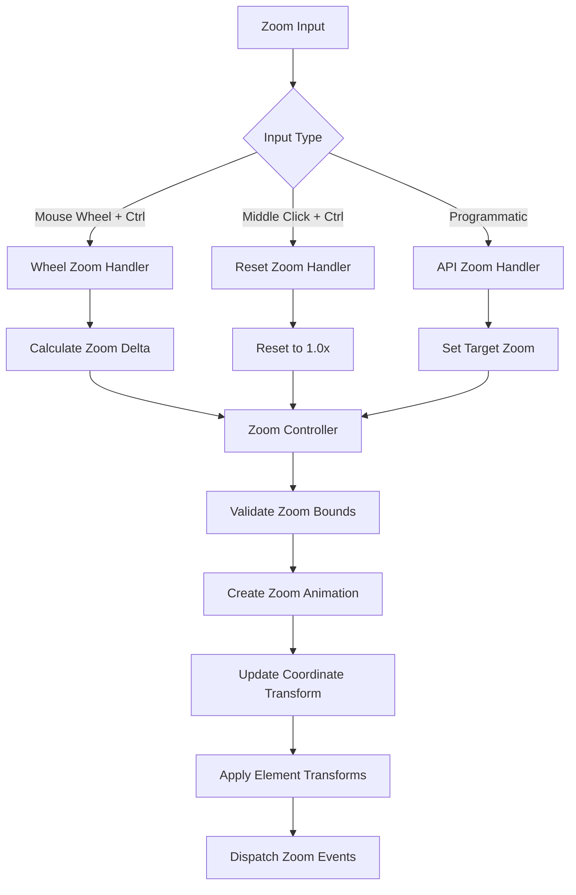

# Design Document

## Overview

The Zoom Controls feature will provide comprehensive zoom functionality for BJSUI by implementing smooth zoom operations with keyboard shortcuts, mouse wheel interactions, and programmatic controls. The design creates a layered zoom system with container-specific zoom areas, smooth animations, coordinate scaling, and proper integration with existing layout and positioning systems while maintaining 60fps performance during zoom operations.

## Architecture

### Core Components

#### ZoomControlService
The main service responsible for zoom management and coordination.

```typescript
interface ZoomControlService {
  enableZoom(container: DomElement, config: ZoomConfig): ZoomController;
  handleZoomInput(controller: ZoomController, input: ZoomInput): void;
  setZoomLevel(controller: ZoomController, level: number, animate?: boolean): void;
  resetZoom(controller: ZoomController, animate?: boolean): void;
  getZoomState(controller: ZoomController): ZoomState;
}
```

#### ZoomController
Manages zoom state and operations for individual containers.

```typescript
interface ZoomController {
  container: DomElement;
  config: ZoomConfig;
  state: ZoomState;
  animation?: ZoomAnimation;
  eventDispatcher: ZoomEventDispatcher;
  coordinateTransform: CoordinateTransform;
}
```

#### ZoomAnimator
Handles smooth zoom transitions and animations.

```typescript
interface ZoomAnimator {
  animateZoom(controller: ZoomController, targetZoom: number, duration: number): Promise<void>;
  updateZoomAnimation(controller: ZoomController, deltaTime: number): void;
  cancelZoomAnimation(controller: ZoomController): void;
  createEasingFunction(type: EasingType): (t: number) => number;
}
```

#### CoordinateTransform
Manages coordinate system transformations during zoom operations.

```typescript
interface CoordinateTransform {
  applyZoomTransform(element: DomElement, zoomLevel: number, zoomCenter: Vector2): void;
  screenToWorld(screenPoint: Vector2, zoomLevel: number): Vector2;
  worldToScreen(worldPoint: Vector2, zoomLevel: number): Vector2;
  updateElementTransforms(container: DomElement, zoomState: ZoomState): void;
}
```

### Zoom System Architecture



## Components and Interfaces

### ZoomConfig
Configuration for zoom behavior:

```typescript
interface ZoomConfig {
  enabled: boolean;
  minZoom: number;
  maxZoom: number;
  zoomStep: number;
  animationDuration: number;
  easingType: EasingType;
  zoomCenter: ZoomCenterMode;
  constrainToContainer: boolean;
  wheelSensitivity: number;
}

enum ZoomCenterMode {
  Cursor = 'cursor',
  Center = 'center',
  TopLeft = 'topLeft',
  Custom = 'custom'
}

enum EasingType {
  Linear = 'linear',
  EaseInOut = 'easeInOut',
  EaseIn = 'easeIn',
  EaseOut = 'easeOut'
}
```

### ZoomState
Current zoom state information:

```typescript
interface ZoomState {
  level: number;
  center: Vector2;
  bounds: ZoomBounds;
  isAnimating: boolean;
  lastUpdate: number;
}

interface ZoomBounds {
  minX: number;
  maxX: number;
  minY: number;
  maxY: number;
}
```

### ZoomAnimation
Animation state for smooth zoom transitions:

```typescript
interface ZoomAnimation {
  startZoom: number;
  targetZoom: number;
  startTime: number;
  duration: number;
  easingFunction: (t: number) => number;
  onComplete?: () => void;
  onUpdate?: (currentZoom: number) => void;
}
```

### ZoomInput
Input event data for zoom operations:

```typescript
interface ZoomInput {
  type: ZoomInputType;
  delta?: number;
  position?: Vector2;
  targetZoom?: number;
  animate?: boolean;
}

enum ZoomInputType {
  Wheel = 'wheel',
  Reset = 'reset',
  Programmatic = 'programmatic',
  ZoomIn = 'zoomIn',
  ZoomOut = 'zoomOut'
}
```

## Data Models

### ZoomEvent
Event data for zoom state changes:

```typescript
interface ZoomEvent {
  type: ZoomEventType;
  controller: ZoomController;
  previousZoom: number;
  currentZoom: number;
  zoomCenter: Vector2;
  timestamp: number;
}

enum ZoomEventType {
  ZoomStart = 'zoomStart',
  ZoomUpdate = 'zoomUpdate',
  ZoomEnd = 'zoomEnd',
  ZoomReset = 'zoomReset'
}
```

### ZoomConstraints
Constraints for zoom operations:

```typescript
interface ZoomConstraints {
  minZoom: number;
  maxZoom: number;
  stepSize: number;
  snapToSteps: boolean;
  allowedZoomLevels?: number[];
  containerBounds?: Rectangle;
}
```

## Implementation Strategy

### Mouse Wheel Zoom Implementation

```typescript
class WheelZoomHandler {
  handleWheelEvent(event: WheelEvent, controller: ZoomController): void {
    // Check if Ctrl/Cmd is pressed
    if (!event.ctrlKey && !event.metaKey) return;
    
    // Prevent default browser zoom
    event.preventDefault();
    
    // Calculate zoom delta
    const delta = -event.deltaY * controller.config.wheelSensitivity;
    const zoomFactor = Math.pow(1.1, delta / 100);
    const newZoom = controller.state.level * zoomFactor;
    
    // Get cursor position for zoom center
    const cursorPosition = this.getCursorPosition(event, controller.container);
    
    // Apply zoom with cursor as center
    this.zoomControlService.setZoomLevel(controller, newZoom, true, cursorPosition);
  }
  
  private getCursorPosition(event: WheelEvent, container: DomElement): Vector2 {
    const rect = container.mesh.getBoundingInfo().boundingBox;
    const x = (event.clientX - rect.minimumWorld.x) / (rect.maximumWorld.x - rect.minimumWorld.x);
    const y = (event.clientY - rect.minimumWorld.y) / (rect.maximumWorld.y - rect.minimumWorld.y);
    return new Vector2(x, y);
  }
}
```

### Zoom Animation Implementation

```typescript
class ZoomAnimator {
  animateZoom(controller: ZoomController, targetZoom: number, duration: number): Promise<void> {
    return new Promise((resolve) => {
      const animation: ZoomAnimation = {
        startZoom: controller.state.level,
        targetZoom: this.clampZoom(targetZoom, controller.config),
        startTime: performance.now(),
        duration,
        easingFunction: this.createEasingFunction(controller.config.easingType),
        onComplete: resolve
      };
      
      controller.animation = animation;
      this.startAnimationLoop(controller);
    });
  }
  
  private startAnimationLoop(controller: ZoomController): void {
    const animate = () => {
      if (!controller.animation) return;
      
      const elapsed = performance.now() - controller.animation.startTime;
      const progress = Math.min(elapsed / controller.animation.duration, 1);
      const easedProgress = controller.animation.easingFunction(progress);
      
      const currentZoom = this.lerp(
        controller.animation.startZoom,
        controller.animation.targetZoom,
        easedProgress
      );
      
      this.applyZoomLevel(controller, currentZoom);
      
      if (progress < 1) {
        requestAnimationFrame(animate);
      } else {
        this.completeAnimation(controller);
      }
    };
    
    requestAnimationFrame(animate);
  }
}
```

### Coordinate Transform Implementation

```typescript
class CoordinateTransform {
  applyZoomTransform(element: DomElement, zoomLevel: number, zoomCenter: Vector2): void {
    const transform = this.calculateZoomTransform(element, zoomLevel, zoomCenter);
    
    // Apply transform to element mesh
    element.mesh.scaling = new BABYLON.Vector3(zoomLevel, zoomLevel, 1);
    element.mesh.position = transform.position;
    
    // Update child elements recursively
    for (const child of element.children) {
      this.applyZoomTransform(child, zoomLevel, zoomCenter);
    }
  }
  
  private calculateZoomTransform(element: DomElement, zoomLevel: number, zoomCenter: Vector2): Transform {
    const originalPosition = element.originalPosition || element.mesh.position.clone();
    
    // Calculate offset from zoom center
    const offsetX = (originalPosition.x - zoomCenter.x) * (zoomLevel - 1);
    const offsetY = (originalPosition.y - zoomCenter.y) * (zoomLevel - 1);
    
    return {
      position: new BABYLON.Vector3(
        originalPosition.x + offsetX,
        originalPosition.y + offsetY,
        originalPosition.z
      ),
      scale: new BABYLON.Vector3(zoomLevel, zoomLevel, 1)
    };
  }
}
```

### Programmatic Zoom API

```typescript
class ZoomAPI {
  setZoom(controller: ZoomController, level: number, animate: boolean = true): void {
    const clampedLevel = this.clampZoom(level, controller.config);
    
    if (animate) {
      this.zoomAnimator.animateZoom(controller, clampedLevel, controller.config.animationDuration);
    } else {
      this.applyZoomLevel(controller, clampedLevel);
    }
  }
  
  zoomIn(controller: ZoomController): void {
    const newLevel = controller.state.level * (1 + controller.config.zoomStep);
    this.setZoom(controller, newLevel);
  }
  
  zoomOut(controller: ZoomController): void {
    const newLevel = controller.state.level * (1 - controller.config.zoomStep);
    this.setZoom(controller, newLevel);
  }
  
  zoomToFit(controller: ZoomController, bounds: Rectangle): void {
    const containerBounds = this.getContainerBounds(controller.container);
    const scaleX = containerBounds.width / bounds.width;
    const scaleY = containerBounds.height / bounds.height;
    const zoomLevel = Math.min(scaleX, scaleY);
    
    this.setZoom(controller, zoomLevel);
  }
  
  resetZoom(controller: ZoomController): void {
    this.setZoom(controller, 1.0);
  }
}
```

## Integration Points

### BabylonDomService Extension
Integration with existing DOM element creation:

```typescript
// In babylon-dom.service.ts
private handleZoomableElement(element: DomElement): void {
  const zoomConfig = this.parseZoomConfig(element.style);
  
  if (zoomConfig.enabled) {
    const zoomController = this.zoomControlService.enableZoom(element, zoomConfig);
    element.zoomController = zoomController;
    
    // Set up zoom event listeners
    this.setupZoomEventListeners(element);
  }
}
```

### Event System Integration
Coordination with existing interaction systems:

```typescript
// In event handling
private handleZoomInteraction(event: InteractionEvent): void {
  const element = this.findZoomableContainer(event.target);
  
  if (element?.zoomController) {
    switch (event.type) {
      case 'wheel':
        if (event.ctrlKey || event.metaKey) {
          this.zoomControlService.handleZoomInput(element.zoomController, {
            type: ZoomInputType.Wheel,
            delta: event.deltaY,
            position: this.getEventPosition(event)
          });
          event.preventDefault();
        }
        break;
      case 'auxclick':
        if ((event.ctrlKey || event.metaKey) && event.button === 1) {
          this.zoomControlService.resetZoom(element.zoomController, true);
          event.preventDefault();
        }
        break;
    }
  }
}
```

## Performance Optimizations

### Transform Caching
- Cache original element positions to avoid recalculation
- Use efficient matrix operations for coordinate transforms
- Implement incremental updates for small zoom changes

### Animation Optimization
- Use requestAnimationFrame for smooth 60fps animations
- Implement animation culling for off-screen elements
- Provide performance fallbacks for low-end devices

### Memory Management
- Clean up zoom controllers for removed elements
- Dispose animation resources properly
- Optimize coordinate transform calculations

## Error Handling

### Zoom Boundary Management
- Clamp zoom values to configured min/max limits
- Handle edge cases with zero or negative zoom values
- Provide graceful fallbacks for invalid zoom operations

### Animation Conflicts
- Handle overlapping zoom animations gracefully
- Resolve conflicts between user input and programmatic zoom
- Manage animation state during rapid zoom changes

### Performance Issues
- Monitor zoom performance and provide fallbacks
- Implement automatic quality reduction for complex scenes
- Provide configuration options for performance tuning

```typescript
interface ZoomErrorHandler {
  handleZoomBoundaryError(controller: ZoomController, attemptedZoom: number): number;
  handleAnimationConflict(controller: ZoomController, newAnimation: ZoomAnimation): void;
  handlePerformanceIssue(controller: ZoomController): void;
}
```

## Testing Strategy

### Visual Test Sites
Test sites will be created in `site-data.service.ts` to validate zoom functionality:

1. **Basic Zoom Controls**: Ctrl+wheel zoom in/out with smooth animations
2. **Zoom Reset**: Ctrl+middle click zoom reset to 100%
3. **Container-Specific Zoom**: Different zoom settings for nested containers
4. **Zoom Constraints**: Min/max zoom limits and boundary handling
5. **Programmatic Zoom**: API-driven zoom operations and state management
6. **Zoom with Interactions**: Zoom behavior with hover states and click events
7. **Performance Test**: Zoom with large numbers of elements

### Expected Visual Outcomes
Each test site will include documentation of expected zoom behavior, animation smoothness, and performance characteristics.

## Dependencies

### Browser APIs
- Wheel Event API for mouse wheel zoom detection
- Pointer Events API for middle click detection
- RequestAnimationFrame for smooth animations

### BabylonJS Features
- Mesh scaling and positioning for zoom transforms
- Scene coordinate system management
- Animation system integration

### Existing BJSUI Services
- BabylonDomService: DOM element integration
- BabylonMeshService: Mesh transformation management
- Event system: Input event handling and processing
- Camera service: Viewport and coordinate system management

## Future Enhancements

### Advanced Zoom Features
- Pinch-to-zoom gesture support for touch devices
- Zoom with momentum and physics-based deceleration
- Multi-touch zoom center calculation

### Zoom UI Controls
- Visual zoom controls (+ and - buttons)
- Zoom level indicator and slider
- Zoom presets and bookmarks

### Integration Features
- Zoom state persistence across sessions
- Zoom synchronization between multiple views
- Zoom-aware layout and responsive design